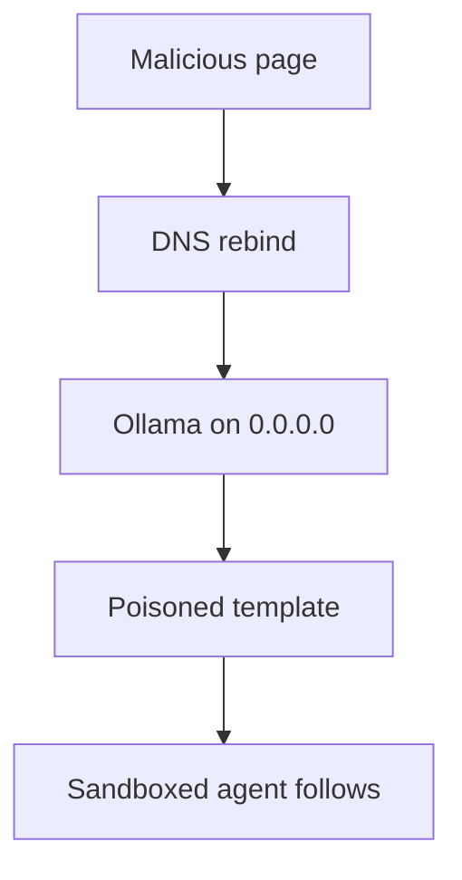

NVIDIA NemoClaw deploys OpenClaw in OpenShell Docker sandboxes, and because the container cannot reach `127.0.0.1` on the host, NemoClaw starts Ollama with `OLLAMA_HOST=0.0.0.0:11434`. That bind listens on every interface; it is not loopback.

The installer prints `Using Ollama on localhost:11434`, but the socket is not bound to localhost only. Ollama’s API on port 11434 has no authentication, so CORS and Host validation are the defenses. Ollama checks the Host header so a webpage cannot pretend to be local, but that check is skipped when the bind is not loopback, which means binding to `0.0.0.0` drops it.

DNS rebinding fills the gap: an attacker owns a domain, the victim visits a page on that domain, and then the name resolves to `127.0.0.1`. The browser still thinks it is talking to the attacker’s site, and Origin equals Host, so CORS passes and the page now has unauthenticated access to the local model server.

The useful payload is not a one-shot prompt. `/api/create` accepts a `template` field, which is a Go template applied at inference to every message, including the system prompt the client sends. Injecting a system-prompt field is not enough, because OpenClaw sends its own system prompt and would overwrite that; template injection survives it.

The poison persists across conversations and does not show in the model name, size, or metadata, so every consumer of that model is affected.

OpenShell still limits the host filesystem, network, and process, but the blast radius is not that wall: it is the agent’s authorized tools and the organization’s resources those tools can already reach. `0.0.0.0` also exposes the API on the LAN, where no rebinding is required.

CVE-2026-65105 is the identifier; Oasis Security found it in NemoClaw, and Cyera published on 25 August 2026. Do not treat loopback as a property of the log line. Treat it as a property of the bind.

## Recommendations

- Treat loopback as a property of the bind, not of a log line that says localhost.
- Do not bind an unauthenticated model API to `0.0.0.0`.
- Disable or authenticate `/api/create` template fields on local inference servers.
- Assume a sandboxed agent that follows a poisoned model can still spend its authorized tools.
- Recheck Host and CORS behavior after any bind-address change.
