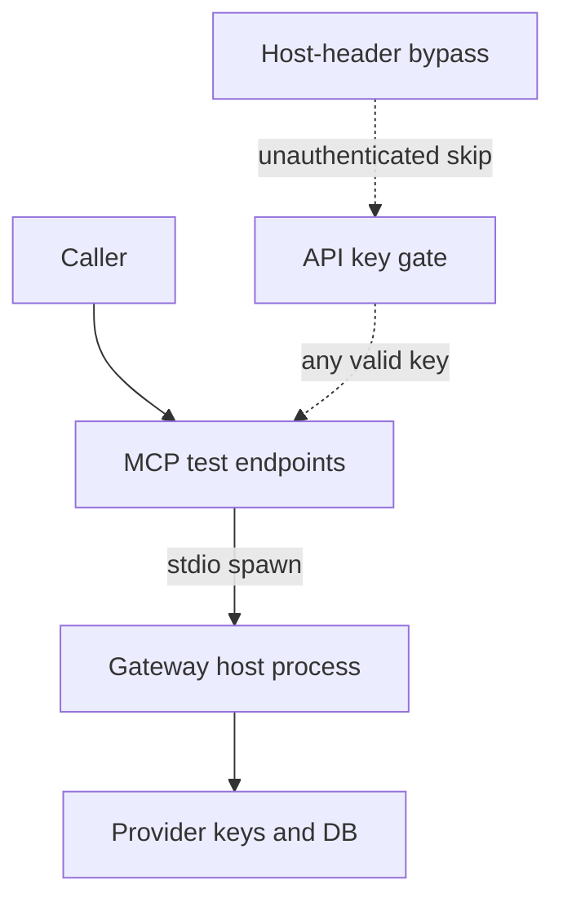

LiteLLM sits between applications and model providers. It holds provider keys, virtual keys, routing policy, and often a database connection string, so the gateway process is closer to a secrets store than to a simple proxy. That concentration is what made the MCP preview path expensive.

From version 1.74.2 through before 1.83.7, two endpoints used to preview an MCP server before saving it — `POST /mcp-rest/test/connection` and `POST /mcp-rest/test/tools/list` — accepted a full server configuration in the request body, including the `command`, `args`, and `env` fields used by the stdio transport. When those fields arrived, the endpoints tried to connect, which spawned the supplied command as a subprocess on the proxy host with the privileges of the proxy process. The gate was only a valid proxy API key, with no role check, so any authenticated user, including holders of low-privilege internal-user keys, could run arbitrary commands on the host. GitHub advisory GHSA-v4p8-mg3p-g94g tracks that as CVE-2026-42271. The fix in 1.83.7 requires the gateway’s admin role (`PROXY_ADMIN`) on both test endpoints, matching the save path.

CISA added CVE-2026-42271 to the Known Exploited Vulnerabilities catalog on 8 June 2026, with a federal remediation due date of 22 June 2026. That is not a theoretical residual. It is a government confirmation that the preview path was being used in the wild.

Microsoft Threat Intelligence later reported a LiteLLM gateway compromise in which initial access was consistent with the public chain that pairs CVE-2026-42271 with CVE-2026-48710, a Starlette Host-header validation bypass. In that chain, the MCP stdio test path supplies host command execution, and the Host-header flaw can weaken the authentication boundary so the same capability becomes reachable without a valid key. From the gateway process, Microsoft observed credential harvesting from the process environment, payload staging, PostgreSQL collection of model and virtual-key tables, persistence, and compute abuse. The blast radius was the gateway’s role, not a single app bug.

A preview or connection-test surface that can spawn stdio is not a sandbox. It is a host-execution path sitting on the same process that already holds the estate’s model credentials. Role-gate it like any other admin action, keep management interfaces off the public internet, and treat the AI gateway as Tier-0 infrastructure. Do not leave “test” in the name as if that made the residual optional.

## Recommendations

- Role-gate every MCP preview or connection-test endpoint the same way as the save path.
- Do not let a preview surface spawn stdio on a host that holds provider keys.
- Keep gateway management interfaces off the public internet.
- Treat the AI gateway process as Tier-0 infrastructure and monitor it as such.
- After patching, re-check that test endpoints reject non-admin keys and unauthenticated Host-header tricks.
