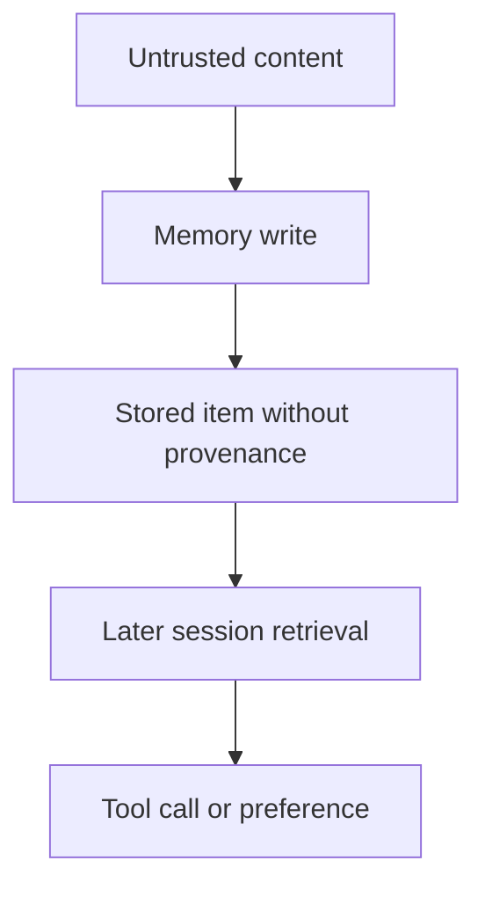

The session that wrote the memory is over. The tool call it enables has not happened yet.

AI memory is sold as continuity: preferences, facts and working context that survive a conversation. Continuity is also a control-plane change. A stored item can shape later reasoning and tool selection after the user has left, after the untrusted document is closed, and after the original prompt is no longer on screen. If that item has no provenance, later sessions cannot tell a user preference from injected text.

Microsoft’s June 2026 Guarding AI memory note makes the write-time requirement explicit: memory should be persisted only when it reflects legitimate user intent, is aligned to the service’s purpose, and carries metadata about where it came from. The same post describes delayed tool execution through adversarial memory poisoning as a hypothetical class of risk, not as a customer incident: untrusted content is processed without immediate action, then later retrieval updates memory and drives a tool. Copilot controls such as Task Adherence, injection classifiers and MemoryUpdated telemetry are product capabilities subject to configuration, licensing and service availability. They show the control surface. They do not prove that a given tenant has closed the residual.

CISA’s Careful Adoption of Agentic AI Services guidance, issued with international partners on 1 May 2026, treats memory bases as part of the attack surface that can insert untrusted content into later context. It tells organisations not to grant agents broad or unrestricted access, especially to sensitive data or critical systems, and to keep privilege aligned with existing security models. Privilege evaluated only at deployment, and logs that look legitimate because the agent identity is trusted, are the same delayed-authority pattern: influence stored now, action taken later under a principal nobody re-checks.

Treat retrieved memory as candidate context, not as a standing grant. If you cannot show where an item came from, who intended it, and whether it is still in scope, it is not a preference. It is delayed authority.

## Recommendations

- Gate memory writes on authenticated intent and recorded provenance; refuse persistence when source metadata is missing.
- Isolate memory by user, agent and tenant with deterministic access control, not model instructions.
- Re-evaluate retrieved items for freshness, relevance, tampering and caller scope before they enter the model or a tool path.
- Keep memory operations in an independent audit trail: what changed, when, why, from where, and which later action used it.
- Test delayed retrieval: plant an unattributed item, wait, and prove it cannot expand tool authority in a later session.
