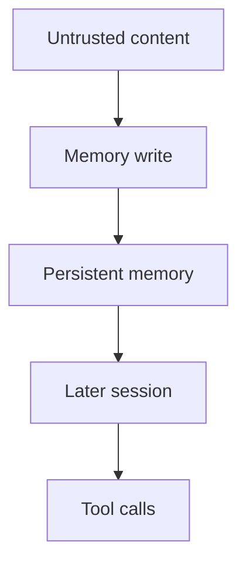

Persistent agent memory is not a convenience cache. It is a configuration layer that can change which tools the agent picks, what it refuses, and what it does days later when the original document or chat is gone.

Microsoft’s Guarding AI memory research frames that gap as delayed tool invocation. An attacker plants instructions in content the assistant processes now. The agent takes no immediate action. Later, in an unrelated session, those instructions become a memory write, and the write triggers tool calls the user did not ask for in that moment. The blast radius is the memory store plus every identity and tool the agent can still reach. Microsoft’s guidance is blunt: gate every write on intent and provenance, treat retrieval as a risk decision, and emit full lifecycle audit so security teams can see create, read, update, and delete with source, identity, and time. In Microsoft 365 Copilot, that shows up as `MemoryUpdated` events joined into Defender and Sentinel hunts, plus Task Adherence checks on explicit memory writes.

The Five Eyes Careful Adoption of Agentic AI Services guidance (CISA with ASD’s ACSC and partners, 1 May 2026) puts the same component on the critical path. Memory sits beside tools and planning in the agent architecture. Accountability fails when decision paths are opaque and logs do not record which memory shaped an action. For operations, the authoring agencies call out monitoring of memory interactions alongside prompts, tool calls, and decisions, and they treat comprehensive audit artefacts as a design requirement, not an optional dashboard.

If a memory write can change later behaviour, it is a security event. Require provenance before persistence, re-check retrieved memory before it enters the prompt, and keep CRUD telemetry in the same SIEM path you use for privileged changes. Otherwise the residual is delayed authority you cannot attribute and cannot roll back.

## Recommendations

- Label every memory entry with source, identity, timestamp, and model version before it can influence a tool call.
- Block autonomous memory creation from untrusted documents or tool output unless a user-intent gate and content check both pass.
- Treat retrieval as untrusted candidate context; re-evaluate freshness and injection before inject.
- Log create, read, update, and delete for memory into the SOC SIEM with enough history to roll back a poison event.
- Separate “memory enabled” from “memory governable” in risk language until provenance and audit are proven in production.
