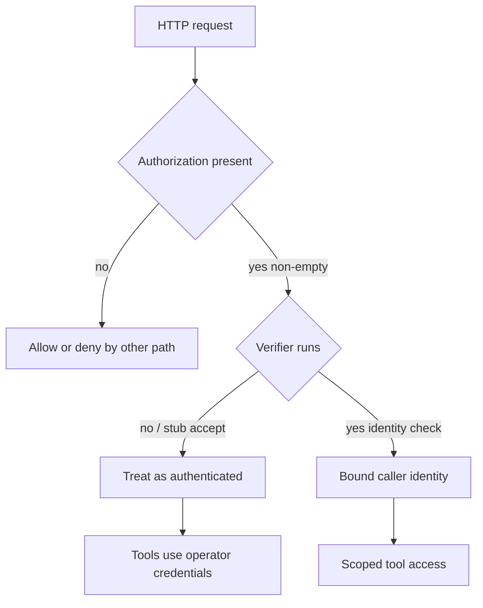

Receiving a token string is not authenticating a caller.

HTTP MCP servers often treat an Authorization header as the auth gate. The architectural residual is what happens after the header is present. If the path only checks that the string is non-empty, or only validates some advertised methods, the operator has enabled a header check, not a credential check. Audit logs that record "authenticated" from that path are recording presence, not proof.

On 10 July 2026, `mcp-atlassian` published `GHSA-wrhw-j3f9-8vc6` (`CVE-2026-77244`) for versions before `0.22.0`. `AtlassianOpaqueTokenVerifier.verify_token` accepted any non-empty string, attached the required scopes, and returned an `AccessToken`. The default HTTP path did not enable the OAuth proxy. Tool handlers that found no verified user token fell back to the operator's environment Jira and Confluence credentials. A network caller could send `Authorization: Bearer anything-at-all`, or omit the header entirely, and still invoke tools as the operator. The header was present. The identity was never checked against Atlassian.

The same residual class appears in an exported MCP security helper. PraisonAI's npm `MCPSecurity` (`GHSA-4qq2-2j2x-x62c` / `CVE-2026-57134`, versions `1.5.1` through `1.7.1`) advertised `basic` and `oauth` alongside `api-key` and `bearer`. The evaluator only called the configured `validate` callback for `api-key` and `bearer`. For `basic` and `oauth`, any non-empty Authorization value skipped the validator and returned allowed. A PoV that made `validate` always return false still rejected invalid api-key and bearer credentials, while invalid basic and oauth credentials passed with zero validator calls. The method name said OAuth. The control that ran was "header non-empty."

Treat Authorization as a containment claim only when every advertised auth method runs a real verifier before tools execute, and when missing or garbage credentials fail closed instead of falling back to operator env tokens. Prove in tests that `Bearer garbage`, invalid Basic, and invalid OAuth are rejected with the configured validator called. Otherwise the residual is a green auth policy and a caller who never proved who they are.

## Recommendations

- Reject HTTP MCP requests that lack a verified caller identity; do not fall back to operator environment credentials by default.
- Call the configured token validator for every advertised auth method, including Basic and OAuth, before marking the request authenticated.
- Fail closed when no validator is configured for bearer, oauth, or basic; do not treat non-empty as success.
- Prove in CI that garbage Bearer, invalid Basic, and invalid OAuth credentials are denied and that the validator is invoked.
- Bind HTTP MCP transports to loopback unless an explicit public-bind flag and real auth are both set.
