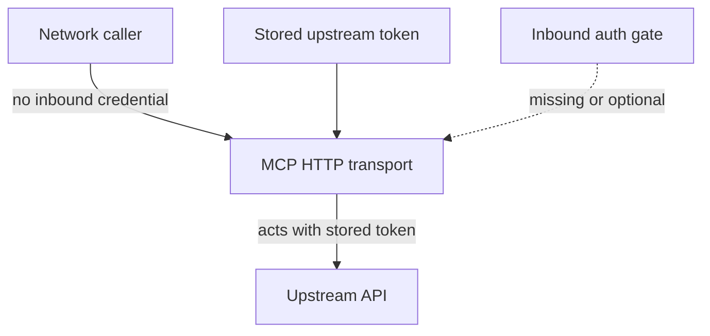

MCP servers often hold a long-lived credential so they can call an upstream API on the operator’s behalf. That credential is outbound trust. Inbound auth is a separate question: who is allowed to open a session and drive those tools. Two Critical advisories in late August 2026 show what happens when the outbound token is present and the inbound gate is not.

`argocd-mcp` 0.8.0 is tracked as CVE-2026-82456 and GitHub advisory GHSA-p2x5-x87w-v2xj, rated Critical 10.0. When `ARGOCD_API_TOKEN` is configured, the HTTP transport binds on every network interface and accepts MCP sessions without requiring caller credentials. Anyone who can reach the listener can create applications, request syncs, and modify Argo CD resources using the operator’s stored token. The token that makes the server useful is the same token that makes the missing inbound check catastrophic.

The Telnyx MCP server through 6.83.0 repeats the pattern as CVE-2026-81098 and GHSA-j929-p4w2-gfw7, rated Critical 9.1. Its HTTP transport also listened on every interface and parsed caller authentication headers in a mode that did not fail when they were absent. A request with no credential completed initialisation and dispatched tools. Dispatch then forwarded the server’s own stored Telnyx API key, client secret, and code-execution key upstream, so an unauthenticated caller acted with those secrets. The current code defaults the host to loopback, requires a server API key, and enforces it in middleware.

A bind to every interface makes the hole easier to find, but the architecture failure is not the bind alone. Configuring an outbound token is not inbound authentication. If the server can spend a privileged credential, callers must prove who they are before any tool runs, and that check has to fail closed when the credential is absent. Treat the stored token as Tier-0 material, put an explicit inbound gate in front of it, and do not read “we have an API token configured” as proof that the listener is authenticated.
