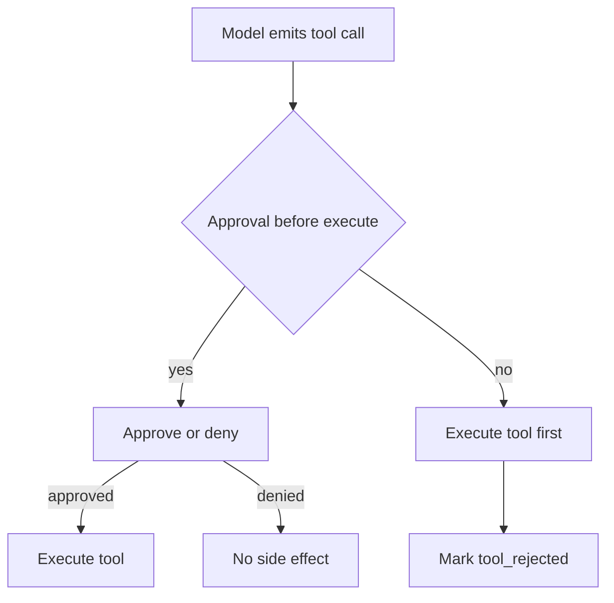

A deny label after the side effect is an audit note, not a gate.

Human-in-the-loop and policy callbacks are documented as pre-execution controls. The architectural residual is ordering. If the harness runs the tool's `execute` handler first, then asks for approval, a `false` return or a `tool_rejected` finish reason arrives too late. The file was written. The command ran. The API call left the host. Operators who trust the reject signal as containment are reading a log of what already happened.

On 17 June 2026, PraisonAI published `GHSA-h2w2-v7j6-xqm4` (CVE-2026-57137) for the npm `praisonai` package. `createAgentLoop()` documents `onToolCall` as an approval callback and ships an example that asks a user before continuing. In versions 1.4.0 through 1.7.1, `AgentLoop.step()` passed executable tools into the wrapped AI SDK `generateText()` call, materialized `toolResults`, and only then invoked `onToolCall`. Because AI SDK executes tools that carry an `execute` function during generation, a callback that returns `false` still sets `finishReason: "tool_rejected"` after the denied tool has already produced side effects. The advisory's local proof shows event order `tool-executed` then `approval-denied`, with `toolResults` populated for the rejected call. Version 1.7.2 moves denial into the wrapped execute path so a denied tool never runs.

The AI SDK tool-approval model that PraisonAI wraps states the correct ordering in public docs. Tools with `execute` run automatically when the model calls them. Approval is a pause before that run. `toolApproval` on `ToolLoopAgent` reviews selected calls before they execute. Loop control treats a tool call that needs approval as a stop before the tool runs. A post-execution callback that reuses the word "approval" conflicts with that contract. The residual is not a missing deny UI. It is treating a finish reason as proof that the side effect never occurred.

Treat every approval hook as a containment claim only when denial is proven before `execute`. Strip executable handlers from the model step, collect tool-call intent, decide, then run. Map custom callbacks onto a real pre-execution pause such as AI SDK `needsApproval` or `toolApproval`. Assert in tests that a denied tool leaves side-effect counters at zero and that `tool_rejected` never coexists with a result from that tool. Otherwise the residual is a green reject signal and a change the operator already said no to.

## Recommendations

- Place every human or policy approval before tool `execute`. Never call generate-and-run with live handlers and then deny afterward.
- Prove in CI that a forced deny leaves side-effect counters at zero and that `tool_rejected` never arrives with a tool result for the denied call.
- Prefer framework-native pre-execution pauses (`toolApproval`, `needsApproval`) over custom post-step callbacks named "approval".
- Inventory agent loops for finish reasons or audit events that imply containment without gating the execute path.
- Log approval decisions with tool name, arguments hash, and whether the tool body ran, so responders can tell a gate from a diary entry.
