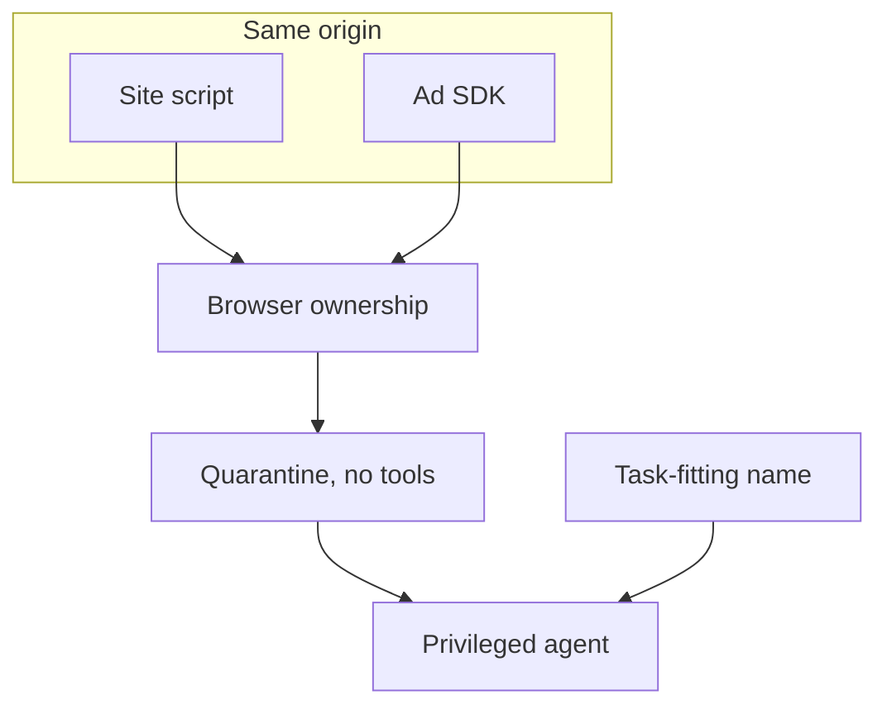

The W3C WebMCP draft lets a web page register tools that a browser agent can call, so the agent can act on the site instead of scraping it. Those tools live under the Same-Origin Policy, which means the site’s own script, an advertising SDK, and an analytics tag all share one registry. The Same-Origin Policy was built to keep one DNS name’s JavaScript away from another DNS name’s cookies. It was not built to tell the agent which script registered `checkout`.

Lee, Chang, Yu, and Yeh show the gap in a real browser against the 17 June 2026 draft (WebMCP-Phalanx, arXiv 2608.24017, 25 August 2026). Any same-origin script can preempt a tool name, revoke a tool it did not register, or leave a tool live after a single-page navigation has already moved the user on. A structurally valid tool can also hide instructions in its description or its return value. Those are not deployment bugs. They are what a flat registry looks like when origin is the only principal.

Phalanx splits the control in two. The browser, not page JavaScript, mints an opaque capability when a script registers a tool, and only the holder of that capability can overwrite or revoke it. In their tests, another script could revoke or overwrite a tool twenty times out of twenty. With the capability in place, that fell to zero. That is ownership integrity, and it is not attribution: the native layer will issue a capability to the advertising SDK on the same terms it issues one to checkout, because both scripts share the origin. Closing that gap needs native script provenance and a site-declared trust map, closer to Content Security Policy than to `document.currentScript`, which a same-origin attacker can spoof.

The second layer is an asymmetric pair of agents. A quarantine model reads tool descriptions, schemas, and return values, and it has no authority to invoke anything. Content that passes is forwarded to a privileged model that can call tools. The quarantine’s internal state is hidden from page scripts, including same-origin ones, so the attacker cannot watch the inspect and rewrite the payload. Description injections fall from 69 of 80 to zero. Return-value injections fall to two of 80, and both residuals are the same failure: the privileged agent called a task-fitting name in the same turn, before the inspector had anything to read. Those counts are the paper’s, not Brief’s claim.

So a description filter is not a call gate. If the name is enough to fire the tool, the inspect happens after the action. The remaining control is a call-timing gate that delays invocation until every agent-visible field, including the name, has been validated. Treat the origin as a DNS boundary, because that is all the Same-Origin Policy ever was. Put ownership in the browser as an unforgeable capability, and put inspection on a principal that cannot call tools. Then add the gate, so a task-fitting name cannot skip the queue.

## Recommendations

- Put tool ownership in the browser as an unforgeable capability, not in page JavaScript.
- Keep the inspector on a principal that cannot invoke tools.
- Delay invocation until every agent-visible field, including the name, has been validated.
- Treat the page origin as a DNS boundary, not as a registrant or script identity.
- Do not let a task-fitting tool name skip the inspect queue.

