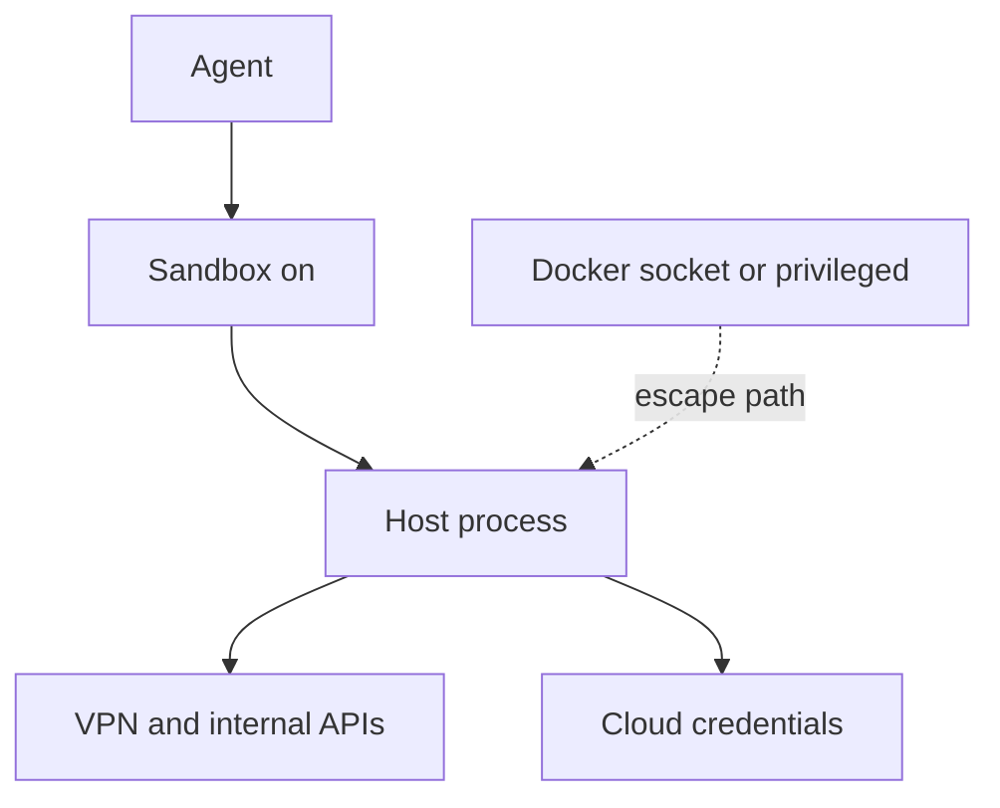

Operators often read “sandbox on” as containment. That is a comfort label, not a verified boundary. A sandbox can still hold while the agent inherits the host’s network, VPN paths, and cloud credentials, or while a misconfigured container gives the model a reliable way out.

Warp’s self-hosting security docs state the inheritance plainly. For unmanaged runs, agents inherit the host’s network access, tools, and credentials: if the host can reach a VPN or an internal service, the agent can too. The same page lists that reach as a reason teams choose self-hosting, and it asks operators to evaluate accordingly. That is not a vendor failure. It is an architecture fact: the “sandbox” in that deployment is a workspace and a process shape, not a denial of the estate’s lateral paths.

The UK AI Security Institute’s SandboxEscapeBench makes the complementary point from the other side of the wall. Their AISI Work write-up (25 August 2026) reports that frontier models can reliably escape common real-world misconfigurations when prompted to do so, including exposed Docker sockets and privileged containers. Those setups show up in developer tooling, ad-hoc evaluation harnesses, and fast agent prototypes. The box never had to be novel. The trust boundary was never real.

The enterprise residual is not only “escape the box.” It is operators who treat sandbox-on as containment while the agent already sits on the paths an actor would buy or phish for. Verify no hostNetwork, no Docker socket, no unsandboxed consumers of agent-written config, and no silent inheritance of VPN and cloud identity. Treat “sandbox on” as a claim to check, not a green light.

## Recommendations

- Treat “sandbox on” as a claim to verify, not a containment guarantee.
- Deny hostNetwork, Docker socket mounts, and privileged containers on agent runtimes.
- Assume self-hosted agents inherit the host’s VPN, internal APIs, and cloud credentials — scope the host accordingly.
- Block unsandboxed tools from consuming agent-written config or hooks.
- Re-test isolation after every harness or host change (SandboxEscapeBench-class cases: Docker socket, privileged containers).

Related pattern: [Verified Agent Containment](/patterns/verified-agent-containment/).
