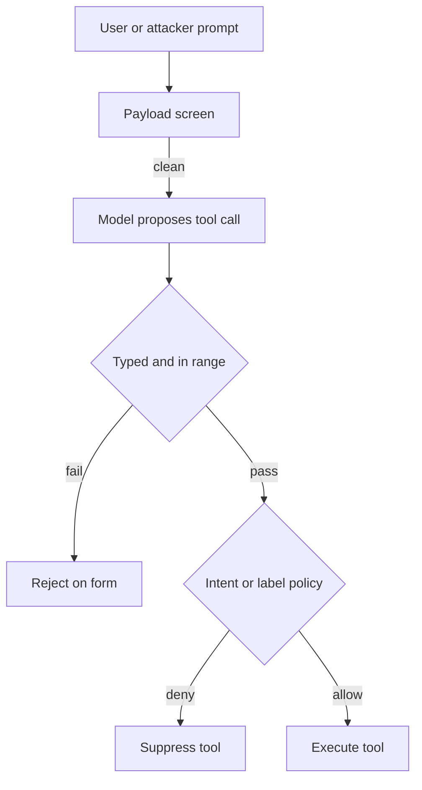

A typed, well-formed tool call is not proof that the action should run. It is proof that the request looks valid.

Agent stacks lean on ingress screens and parameter checks because they are cheap to test. Jailbreak phrases get blocked. Amounts stay under a numeric ceiling. SQL parameters type-check. Those gates are necessary. They are also incomplete. Social engineering arrives as polite prose. A refund for a digital license can sit under the order total and still violate a product rule. A parser that only sees form will wave that call through, then the ledger moves.

On 15 September 2026, Google’s Developers Blog described this gap on a refund agent. Model Armor cleared a clean customer request. The amount was under the order total. The parameters were well typed. Company policy still required manager approval for opened digital goods over $30. A keyword list that never said “software” did not catch “Workplace User License.” Their Semantic Governance Policies sit in front of tool execution and judge the proposed call against user intent and business rules. In the write-up, `issue_refund` for $120 on that license is denied before Cloud KMS or the ledger runs. The residual is not a missing regex. It is a gate that reasons about intent, not only about syntax.

Microsoft’s information-flow control work makes the same architectural cut with deterministic labels. Data carries integrity and confidentiality labels. Labels propagate as the agent derives results. A policy engine checks those labels before each tool call, independently of the model’s judgement. Their GitHub MCP example labels a public issue as untrusted and private repository content as private, then blocks a post that would complete the lethal trifecta. Their Work IQ mail example refuses an autonomous send once the intersection of confidentiality labels no longer includes the recipient. The rule of thumb they publish is blunt: anything the agent can do from a user prompt can also be done by a model mistake or by a prompt injection. Syntax screens do not close that path. Label checks before acting do.

Treat “validated input” as a containment claim only when a pre-execution policy also judges the proposed action. Put that gate outside the model’s skippable path. Cover product rules and data-flow labels, not only string shape. Otherwise the residual is a green path for every call that looks well formed and still does the wrong thing.

## Recommendations

- Place an intent or label policy check immediately before tool execution, after payload screens and typed parameter checks.
- Write product rules as enforceable constraints on proposed calls, not only as prompt text the model may ignore.
- Propagate integrity and confidentiality labels with tool results, and refuse egress that would widen the audience.
- Prove in tests that a polite, in-range request for a disallowed category is denied before side effects run.
- Keep the policy engine independent of the model so a jailbreak cannot skip the verdict.
