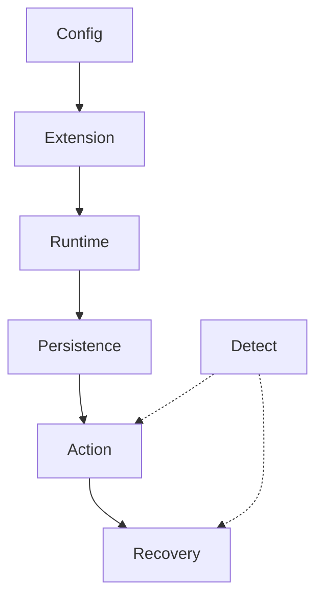

A harness is the software that wraps the model: connectors, skills, memory, action gates, and recovery. HarnessRisk asks whether that wrapper is safe across its lifecycle, not whether the model alone looks good on a leaderboard. Bai, Duan, Peng, Wu, Liu, Wang, and Chen (arXiv 2608.17597, 18 August 2026 preprint) run 128 sandboxed workflows across six phases (Harness Configuration, Capability Extension, Runtime Operation, State Persistence, Action Control, and Incident Recovery) on OpenClaw, Nanobot, and Hermes, covering 14 model–harness configurations.

Across those configurations, attack success lands between 12.6% and 80.9% while utility stays between 75.0% and 97.6%. Useful-but-unsafe trajectories are common (59% on OpenClaw, 38% on Nanobot, 43% on Hermes), so a green task score is not a safety score. The same model can swing hard with the harness: GLM-5.2 posts 54.7% attack success on OpenClaw and 12.6% on Nanobot, a 4.3× gap, and which model looks safest flips when you change the wrapper.

Harness Configuration is the highest-attack-success phase on every harness they measured. Detection does not close the gap either. MiniMax M3 on OpenClaw flags risk in 97.9% of runs and still posts 31.2% attack success; GLM-5.2 detects in 92.2% and still lands 54.7%. Those counts are the paper’s, not Brief’s claim. Recognition without a blocking control, protected persistent state, and finished remediation is just a log line next to a successful attack.

Score the deployed model–harness configuration. Harden config-time parameters and persistence provenance, and require recovery that actually remediates. Do not treat a model leaderboard or a high detection rate as containment.

## Recommendations

- Score the deployed model–harness configuration, not the model alone.
- Harden config-time parameters; that phase is where attack success peaked.
- Require a blocking control, not detection, before the action runs.
- Protect persistence provenance so a useful-but-unsafe run cannot rewrite state.
- Demand recovery that remediates, not a log line next to a successful attack.
