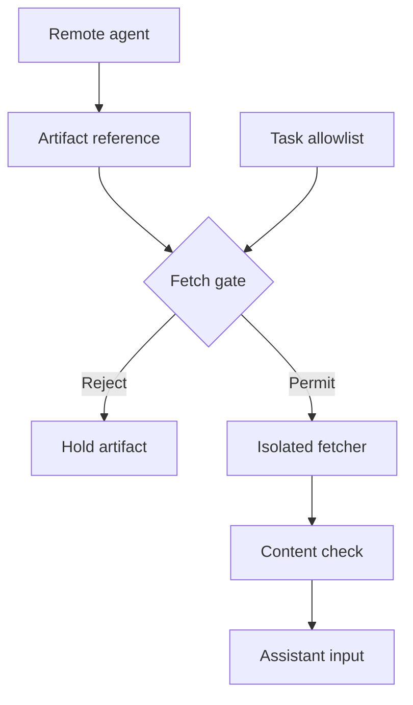

A research agent finishes a vendor comparison and returns an artifact labelled “final spreadsheet.” The receiving assistant expects a file, but the artifact contains a URL. Following that URL is a *new network action by the receiver*, with the receiver's routes and possibly its credentials. The producer's successful task status does not authorize the receiver to fetch that address.

This is a **threat scenario**, not a reported A2A incident or a claim of a protocol flaw. The [A2A specification](https://a2a-protocol.org/v0.3.0/specification/) permits a `FilePart` to carry inline bytes or a `FileWithUri` reference in messages and artifacts. That flexibility crosses a boundary: **remote agent output → local fetch authority → material supplied to the model**. A malicious producer, or compromised artifact source, can exploit an integration that automatically dereferences the URI. Even an honest producer can supply a link whose contents later change.

## The link is not the file

Suppose the receiving service accepts the remote agent's HTTPS URI and sends it to a general-purpose fetch tool. One path points to an internal service through an unsafe redirect or a rebinding name. Another points to a public object that serves a different spreadsheet at retrieval time. A third is a signed object URL: [Google Cloud Storage documents](https://cloud.google.com/storage/docs/access-control/signed-urls) that possession grants time-limited access to the specified resource. Passing such a URL into model context or ordinary logs can disclose a bearer capability. These are conditional outcomes of an unsafe integration; neither the A2A format nor a task-complete event guarantees that any of them happened.

The [OWASP SSRF prevention guidance](https://cheatsheetseries.owasp.org/cheatsheets/Server_Side_Request_Forgery_Prevention_Cheat_Sheet.html) calls for both application and network controls and warns against automatically following redirects. Here there is an additional question beyond whether the socket is safe: **is this the authorized document for this task?** A publicly reachable, well-formed URL can still point to attacker-authored instructions, a stale version, or the wrong tenant's data. A MIME label and filename supplied by the remote agent are descriptions, not integrity checks.

## Give the receiver a narrower fetcher

The **receiving application owner** should decide before delegation which artifact classes, tenants, origins, sizes and content types the task may consume. Prefer inline bytes for small files or a receiver-owned exchange service with a short-lived, task-scoped retrieval grant. For URI artifacts, a fetch broker—not the model or an unrestricted browser—must apply the task policy to the parsed URL and to the actual connection. Resolve and pin the permitted peer, deny local and metadata routes at the network layer, and disable redirects unless every hop is independently authorized. Never attach ambient service credentials to a producer-chosen origin. Treat signed URLs as secrets: redact query strings in traces, and do not hand them to downstream agents as citations.

Before ingestion, bound bytes and decompression, inspect the actual content type, scan as appropriate, and record a digest of the exact bytes accepted. Match the artifact to the expected task and producer, but do not mistake that match for proof that the producer's content is true. Deliver the bytes to the assistant as untrusted evidence, not instructions. Store a receipt with task ID, producer identity, policy revision, redacted origin, resolved destination class, digest, fetch decision and downstream ingestion ID; keep raw sensitive URLs in a restricted store only if needed for investigation.

## Try to fetch the wrong thing

In a staging task, have an authorized remote agent return a valid `FilePart` URI that redirects to a loopback canary, a hostname that changes from a public to a private address between validation and connection, a signed URL for the wrong tenant, and a permitted URL that changes bytes after its first fetch. The first three must cause **zero connections to forbidden targets and zero model ingestion**. The changing object must either be rejected against a pre-agreed digest/version or ingested with a receipt for the exact bytes actually fetched, never silently labelled as the earlier version. Verify the canary's access log, broker decision and ingestion digest; a rejected model answer alone is not enough.

This control cannot prove that an authorized producer wrote a truthful spreadsheet. A compromised permitted origin can still return malicious content, and external signed links may expire before investigation. Keep the fetch boundary separate from content validation and retain the accepted bytes or a governed evidence snapshot where the task warrants it.

Implement the [Task-Bound Artifact Fetch pattern](/patterns/task-bound-artifact-fetch/) for the concrete gate and test cases.

## Recommendations

- Treat every remote artifact URI as a proposed local network action, not a completed file transfer.
- Bind retrieval to the task's allowed producer, tenant and artifact class; fetch through a constrained broker without ambient credentials.
- Enforce destination policy at connection time, block redirects by default, and deny internal routes independently of URL parsing.
- Record the digest of accepted bytes and test wrong-tenant, redirect, rebinding and mutable-content cases against target-side evidence.
