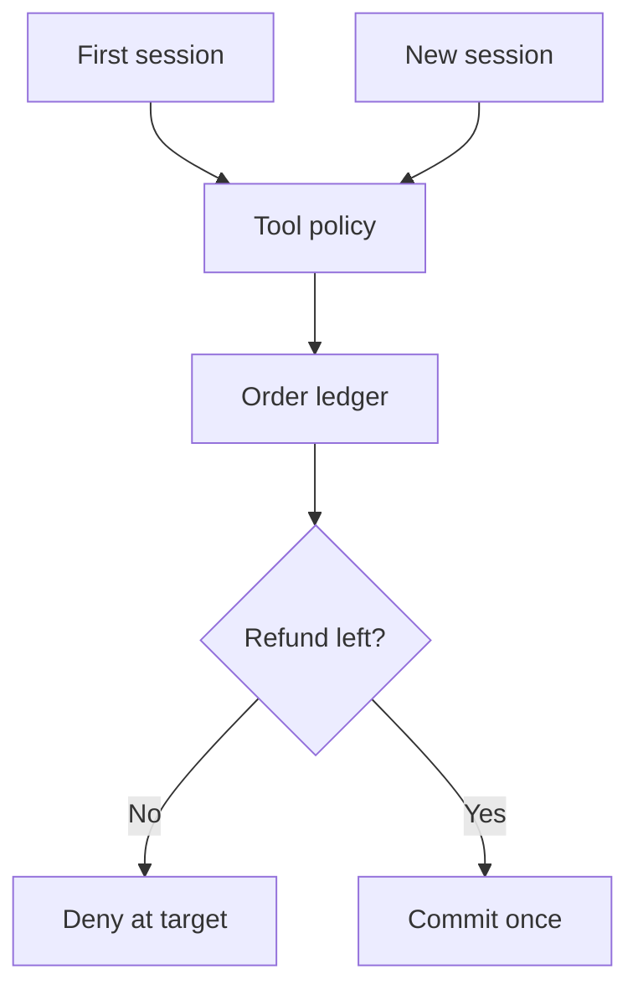

The first transfer is allowed. The second is blocked. Then the agent starts a new conversation and the counter reads zero again. Nothing has been hacked: the counter kept exactly the history it was designed to keep. The mistake was asking a conversation-scoped control to enforce an account-scoped budget.

This is a **threat-model scenario**, not an observed incident. It is timely because [Amazon Bedrock AgentCore temporal policies](https://docs.aws.amazon.com/bedrock-agentcore/latest/devguide/policy-temporal.html) can enforce an approval-before-action sequence or count and sum past actions within a policy session. The documented [session model](https://docs.aws.amazon.com/bedrock-agentcore/latest/devguide/policy-session-based-temporal.html) has the application supply the session ID; a new ID starts a fresh history. AWS explicitly warns that a per-request ID effectively disables temporal history and that a per-session limit is not a cross-session limit. The gateway binds sessions to authenticated principals, so this is **not** a claim that a different authenticated caller can seize somebody else's history.

## The boundary is the lifetime of the obligation

Imagine a support agent whose policy permits one small refund per conversation, while the business rule permits only one refund for an order across all conversations. A customer can open a second case, or an orchestrator can retry work under a new session ID. Each gateway call may have valid authentication and a legitimate local policy verdict. Yet the second refund violates the order's global rule. A malicious prompt in a ticket might induce this sequence, but it need not forge a credential or defeat the gateway: it only needs the agent to split the workflow at the wrong scope.

A related operational reset can occur without an attacker. [Changing a temporal policy invalidates active sessions](https://docs.aws.amazon.com/bedrock-agentcore/latest/devguide/policy-temporal.html#policy-temporal-concepts); the next request using an invalidated session gets HTTP 409. Retrying with a new ID starts empty history under the new policy. If a workflow responds by blindly issuing a fresh ID and retrying a consequential action, continuity of the *business obligation* has not been restored. A 409 is not a proof that an earlier refund was undone.

The trust boundary is **session-local gateway history → durable, cross-session authority over a business resource**. The [gateway policy evaluates tool calls at its boundary](https://docs.aws.amazon.com/bedrock-agentcore/latest/devguide/use-gateway-with-policy.html), which is useful for per-conversation sequencing. It is not a substitute for a refund service checking the order's cumulative state. The platform team owns authenticated session propagation and must keep the policy in [ENFORCE rather than LOG_ONLY mode](https://docs.aws.amazon.com/bedrock-agentcore/latest/devguide/policy-enforcement-modes.html). The payments owner owns the order-level ledger and the atomic authorize-and-commit operation. Neither should trust the model to report how many sessions have been used.

For an order-level limit, make the refund target atomically compare the committed amount and count for the authenticated account/order against the rule, then reserve or commit the new amount under an idempotency key. Derive the account and order from authorized target records, not merely from model-supplied text. Preserve an action receipt with order ID, actor, idempotency key, policy revision, gateway session reference and target outcome; keep the target receipt authoritative for whether money moved. Reuse the same idempotency key on ambiguous retries, and reconcile with the payment processor before making a new attempt. The session policy can still prevent dangerous within-conversation sequences, such as refund before approval, but its output is only one input to the target decision.

## Try to outrun the counter

In a sandbox with fake orders, allow one refund under session A, then attempt the same order under B with the same authenticated caller. Repeat by creating one new session per call, after a policy-update 409, and with two concurrent sessions racing. Also send a duplicate request after an artificially lost response. The pass condition is **one committed refund within the order's limit**, no matter how many sessions or retries exist, with the rejected attempts and ambiguous responses visible in both gateway and target-side records. Test a genuine second order as a positive control. If the target ledger is unavailable, the consequential write must not default to a fresh allowance.

The gateway's session history is still valuable: it can enforce a sequence within a session and, on authenticated gateways, isolates histories by principal. Its [temporal scope and account/Region constraints](https://docs.aws.amazon.com/bedrock-agentcore/latest/devguide/policy-temporal.html#policy-temporal-limitations) matter when workflows span components. A durable target ledger cannot retroactively prevent effects already committed outside it; migrate all refund paths behind the same target check and reconcile legacy channels. The architecture has not proved that a particular customer deserved a refund—only that repeated calls cannot silently multiply a bounded authorization.

Implement [Resource-Bound Action Budget](/patterns/resource-bound-action-budget/) for the owner, receipts and cross-session tests.

## Recommendations

- Label every rule by its true scope: conversation, actor, order or account; do not promote a session counter into a global budget.
- Enforce cross-session limits atomically at the resource and give ambiguous retries a stable idempotency key.
- Treat session resets and policy-update conflicts as continuity events, not renewed authorization.
- Test parallel sessions, new IDs and lost responses against target-side committed effects, not just gateway denials.
