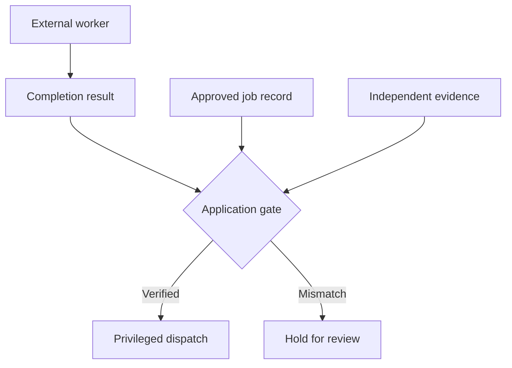

The research assistant waits for an outside reviewer to finish checking a supplier. A callback arrives: `approved: true`. The assistant releases the supplier's confidential dossier to the address in that result. The workflow is green; the callback API accepted the token. Neither fact says the reviewer checked the supplier or that the address belongs to them.

This is a **scenario**, not a reported compromise of a named workflow service. It exposes a different boundary from a retry or a forged tool result: the completion message for a *pending* job becomes authority for the *next* job. A valid completion handle identifies work that may be closed. It is not an attestation of the work's findings, the caller's independence, or permission to trigger another side effect.

## What the callback proves

[AWS Step Functions' callback integration](https://docs.aws.amazon.com/step-functions/latest/dg/connect-to-resource.html) waits for a task token to return with a payload; its [SendTaskSuccess API](https://docs.aws.amazon.com/step-functions/latest/apireference/API_SendTaskSuccess.html) accepts a token and JSON output and returns an empty success response. This establishes a workflow transition, not a general-purpose validation of the output's claims. A caller still needs the applicable AWS permission and a valid, live token; this is not an anonymous-write claim. In another model, [Temporal asynchronous activity completion](https://docs.temporal.io/activity-execution) can use a task token or workflow/activity identifiers to provide a result. Its documentation also warns that a retry may invalidate a task token held by an external service.

Imagine an integration worker with legitimate callback credentials but a compromised data source. The worker reads a partner-controlled status page, maps its `ready` field to `approved`, and returns a partner-supplied destination as `delivery_address`. Or a worker identity itself is compromised. The orchestration service correctly closes the waiting task; the agent then treats the result as an authorization decision. The exploited trust boundary is **external worker assertion → application decision → privileged dispatch**. The attacker need not forge the callback token if a permitted worker can report a false conclusion.

## Turn completion into a claim, not a grant

The application owner should register the job before issuing a completion handle: tenant, task, expected worker identity, permitted result schema, immutable subject and destination constraints, deadline, and the policy revision. Keep the token out of model context, pages, logs and broad queues. The callback adapter should authenticate the worker independently, constrain who may complete which job, validate the schema, and atomically accept a single completion against the still-open record. On an ambiguous timeout, reconcile the recorded completion rather than inviting a different answer.

But authentication and shape checks do not prove a reviewer performed the check. For consequential results, the **decision owner** must check an independently retrievable source: a signed review record from a separate system, a source-system status with version, or a human approval bound to the exact subject and destination. The agent may explain a result; it cannot turn a worker's prose into a new grant. Put the authorization gate at the dispatcher as well as at callback ingestion, since entitlements or destinations can change while the job waits. Record a correlation ID joining approved job, caller identity, evidence version, gate verdict and target receipt; store the sensitive payload elsewhere.

## Try to make the green run lie

In a staging workflow, let an authorized worker return valid JSON and a live completion handle but change the supplier ID, swap the delivery address, claim `approved` without the independent review record, and race a revocation just before dispatch. Each variation must close *no privileged action*, even if the callback transport itself accepts the message. Replay a completed callback and submit two conflicting results concurrently; at most one may become the recorded result and neither should authorize a mismatched dispatch. Inspect the target system, not only the agent trace, for leaked dossiers. This is a test of the application integration, not a claim that Step Functions or Temporal promises semantic verification.

The control cannot certify a reviewer who lies in both the callback and the purported independent evidence, and some downstream effects cannot be recalled. Separate evidence ownership, narrow worker credentials, short-lived task scope and incident reconciliation reduce that residual; they do not make a green workflow synonymous with a true result.

Use the [Evidence-Bound Callback Completion pattern](/patterns/evidence-bound-callback-completion/) to implement the gate and run these negative tests.

## Recommendations

- Treat completion handles as workflow identifiers, not proof of a finding or permission for the next action.
- Bind each callback to a registered job and authenticated worker; validate subject, schema, deadline and policy state before accepting it.
- Require independent, versioned evidence for consequential assertions and recheck authorization at privileged dispatch.
- Test false-but-well-formed results, destination swaps, concurrent callbacks, replay and revocation; compare gate decisions with target-side receipts.
