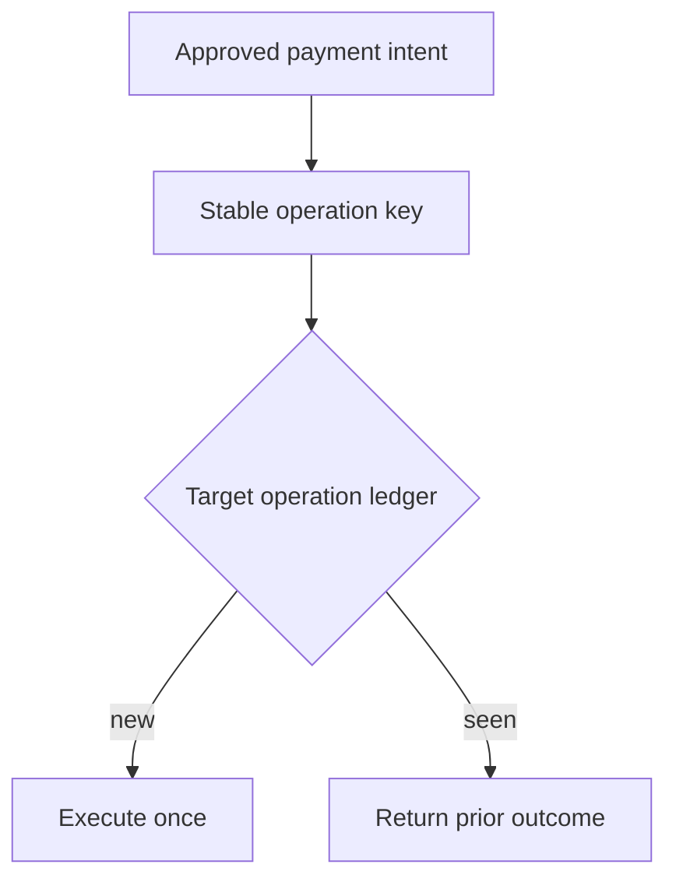

The agent's history shows one approved transfer. The payment service shows two. Both histories can be internally consistent.

[LangGraph checkpoints](https://docs.langchain.com/oss/python/langgraph/checkpointers) preserve workflow state for recovery and time travel, not the state of external services. Its [time-travel documentation](https://docs.langchain.com/oss/python/langgraph/use-time-travel) explicitly says nodes after a selected checkpoint run again, including API requests; interrupts are re-triggered. On ordinary [interrupt resumption](https://docs.langchain.com/oss/python/langgraph/interrupts), the containing node also restarts from its beginning. This is a general architecture question illustrated by a documented execution model, **not a report of a LangGraph exploit**.

Imagine an expense agent with a payment tool. A worker sends a transfer, but crashes before recording the resulting target transaction ID. An operator resumes from a checkpoint or forks the run to investigate. If the payment call is made again with a new request identity, the target may execute a second transfer. A malicious actor who can induce retries or persuade an operator to replay a run can exploit the same ambiguity, but a crash alone is enough. The crossed boundary is between a replayable workflow step and an irreversible external side effect: a checkpoint is not a distributed transaction.

The application owner should mint an operation key from the authorized business intent **before** dispatch and persist it with the intended recipient, amount, tenant and policy/approval revision. A retry of that same operation must carry the same key, even after a worker restart or checkpoint fork. The payment-service owner must atomically reserve that key with the mutation and return the original outcome on duplicate requests; a same-key request with different material parameters must fail. A new intentional payment needs a new approval and key. Where the target cannot enforce this contract, route through an enforcing gateway or require reconciliation and manual release rather than claiming exactly-once execution from workflow logs.

A graph-level guard alone is too weak: it may not know whether an in-flight call took effect when the process died. [LangGraph's compatibility notes](https://docs.langchain.com/oss/python/langgraph/backward-compatibility) also warn that Functional API replay matches cached task results and resume values by call position; changing the order of tasks or interrupts for in-flight runs can attach a result to the wrong call. Pin or drain old workflow versions during a change, and bind the target operation key to immutable intent fields rather than a mutable step number or thread ID. The thread locates a checkpoint; it is not the transaction identity.

## Negative test

Send a harmless test transfer with a fixed operation key. Stop the worker **after the target commits but before the workflow records success**, then resume, replay from a pre-dispatch checkpoint and fork that checkpoint. Assert exactly one target-side transaction and the same original receipt on all duplicate attempts. Change the amount while reusing the key: the target must reject it without mutation. Repeat after a workflow-code update that inserts an earlier task, and confirm in-flight runs are pinned or drained rather than silently reinterpreted. Reconcile gateway attempts, target ledger entries and approval IDs; a single green agent trace is not the oracle.

This does not make arbitrary external effects reversible. If the target has no durable deduplication boundary, a gateway that only remembers requests locally cannot promise exactly once across target/network failures. Keys need retention at least as long as the supported retry and replay window; after expiry, quarantine old replays. An attacker with authority to create a *new* approved payment can still send it. The control is for duplicate execution of one authorized intent, not payment-fraud detection.

Related pattern: [Replay-Fenced Agent Side Effects](/patterns/replay-fenced-agent-side-effects/).

## Recommendations

- Persist an immutable operation identity with each approved external action before dispatch, and reuse it on every recovery path.
- Enforce duplicate suppression and parameter matching atomically at the target or an equivalent authoritative boundary.
- Crash after target commit in a test and compare target receipts with workflow history; pin or drain in-flight workflows across incompatible replay changes.
