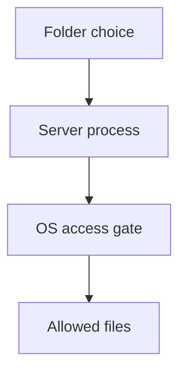

A folder picker can look like a permission prompt. For an MCP filesystem server, it may be only a map.

The July 2026 MCP specification says roots tell servers which files and directories are relevant; they are **informational guidance, not access control**. The protocol does not keep a server inside them.[1] The client documentation says the actual boundary must be enforced by OS permissions or sandboxing.[2] Roots were also deprecated in that revision: new implementations should not adopt them, and existing ones should migrate to explicit paths or resource URIs.[1][3]

Here is a **hypothetical** failure: a user picks a project directory as the sole root. A compromised local MCP server process receives a file-read request whose path points outside that directory, or simply opens another readable file itself. If the server runs with the user's broad filesystem privileges, the picker cannot stop that read. A cooperative server might reject it; a hostile one is not bound by the list. This is a process-authority problem, not evidence of a particular product breach.

The exploited trust boundary is between client-provided *intent* and the server process's real file descriptors and credentials. Passing a directory as a tool argument after migration is still only an instruction unless the execution environment restricts access. To enforce a project-only read policy, launch the server with a filesystem allowlist or dedicated account that cannot read other data; resolve and open paths under that boundary, taking symlinks and path changes into account. Keep the host's tool authorization separate from the model's choice to call it.

## Recommendations

- From the **actual server process**, attempt to open a known readable decoy outside the selected project. The operating system should deny it, not merely a prompt or server-side string check.
- Try `..`, absolute paths, symlinks from inside the project to outside, and a path whose symlink target changes between validation and open. Verify no bytes reach the tool result.
- Remove or narrow the user's project grant during a session and retry. Confirm both the application policy and process-level permissions reflect the change.
- Review the migration path: replacing deprecated roots with explicit tool parameters is not a substitute for process isolation.[1][3]

Even a properly confined filesystem server may still return malicious text from an allowed project file. Filesystem containment limits *where* it reads; tool-result prompt injection and write permissions need separate controls.

Related pattern: [Enforced Filesystem Scope for MCP Servers](/patterns/enforced-filesystem-scope-for-mcp-servers/).
