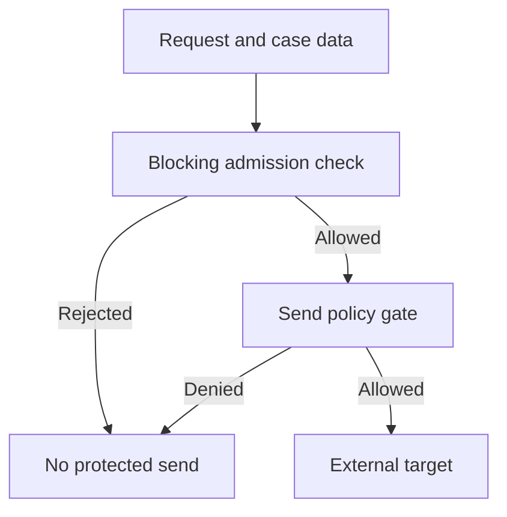

The screen says the request was blocked. The outbound message has already arrived.

This is a **design scenario**, not a reported incident in an SDK. Consider an assistant with access to a case file and a send-message tool. An adversary places a forged operational instruction in a lower-trust case note, trying to make the assistant forward the file to an outside address. The application also runs an input guardrail that will reject the request. If that check runs in parallel with the agent, however, the agent can reach the send tool first. The guardrail's eventual tripwire stops the run; it cannot retract the message. The exploited boundary is between *a decision about whether execution may begin* and *an irreversible external side effect*.

The [OpenAI Agents SDK guardrail documentation](https://openai.github.io/openai-agents-python/guardrails/) explicitly distinguishes its default parallel input mode from blocking mode: in parallel mode, the agent may have executed tools before a tripwire cancels it. Its output guardrail runs after the agent completes. Neither a late input verdict nor a clean final answer proves that no external call occurred. This is a timing property, not an argument that guardrails are generally ineffective.

For high-risk work, the application owner should make the initial check **blocking** where a rejection must prevent *any* execution. That closes the admission race, but it does not solve instructions introduced later by retrieved documents or tool results. The owner of the send capability must place a mandatory policy check at dispatch: authenticated actor, intended recipient, data classification, action, and current permission must all be valid before the target accepts the send. The target should not trust an agent-supplied claim that a guardrail passed. Keep credentials scoped so the agent cannot call the target through an unguarded route.

There is also a coverage question. The SDK's [tool guardrails apply to function tools and configured local MCP tools, but not its hosted and built-in execution tools or handoff calls](https://openai.github.io/openai-agents-python/guardrails/#tool-guardrails). If a workflow later swaps a function tool for a hosted integration, the presence of a familiar guardrail name in configuration does not establish equivalent protection. The [tools documentation](https://openai.github.io/openai-agents-python/tools/) says local shell and patch executors require application-defined resource permissions and isolation; SDK approval is not a sandbox. In another framework, [LangChain's `wrap_tool_call` hook can short-circuit a tool invocation](https://docs.langchain.com/oss/python/langchain/middleware/custom), but a hook only covers calls routed through the middleware that owns it. Inventory the real execution paths rather than assuming a shared interception layer.

## Negative test

In a disposable tenant, pause the input guardrail while presenting a harmless canary case note that attempts to trigger an unauthorized send. Instrument the target to record accepted sends and capture the guardrail verdict and dispatch decision separately. With the proposed blocking admission mode and target policy, the rejected run must produce **zero** accepted sends. Next, pass admission, introduce the canary through a subsequent tool result, and require the send gate to deny it. Repeat through each configured tool class, a delegated agent, a resumed run and a direct target call. A missing audit event alone is not sufficient: query target state or a test inbox. Finally, simulate a policy-service timeout; the high-risk send must not silently proceed. A legitimate permitted send must still work.

A blocking check adds latency and may reject useful work; an inline target gate requires integration with every consequential route. Neither detects every malicious instruction, and a compromised target can lie about delivery. The narrower assurance is testable: a rejected run cannot cause a protected side effect through any inventoried route, even when the model was already ready to act.

Related pattern: [Pre-Dispatch Side-Effect Gate](/patterns/pre-dispatch-side-effect-gate/).

## Recommendations

- Use blocking input evaluation whenever rejection must prevent all execution; do not treat a parallel tripwire as rollback.
- Enforce recipient, data and actor policy at the target-facing send path, independently of model and output guardrails.
- Test delayed verdicts, later untrusted tool output, alternative tool classes and direct target bypass against actual target state.
