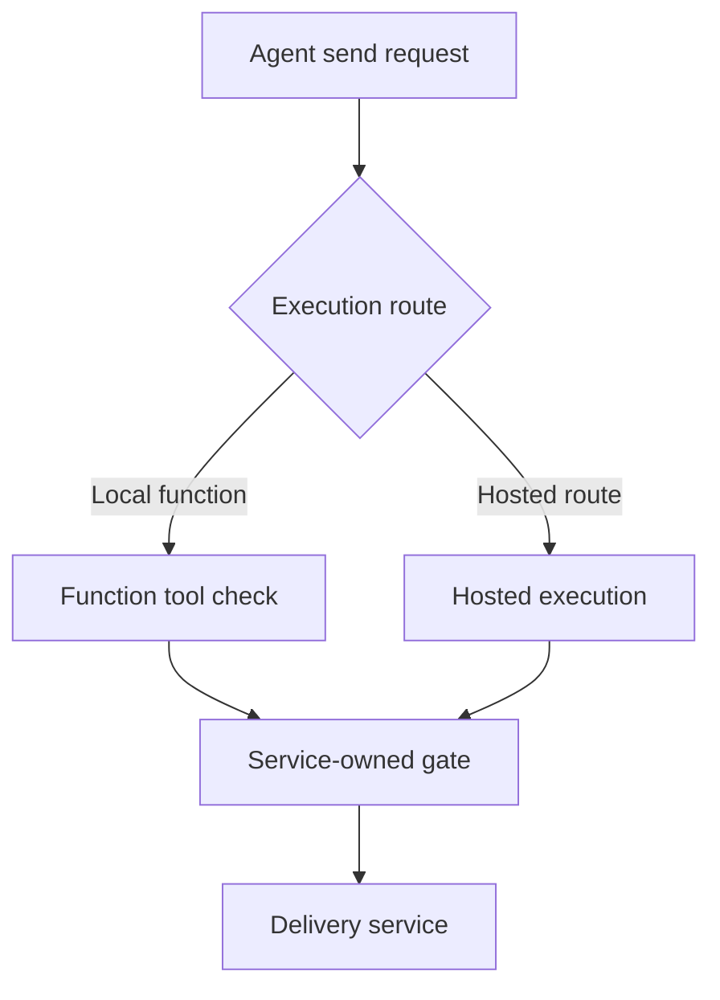

A team puts a recipient check on its `send_report` function tool. The test with a forbidden address trips the guardrail. Then the team gives the same agent a hosted delivery route and assumes the check follows the verb. It does not follow the verb; it follows the wrapper.

This is an **architecture test scenario**, not a reported exploit in the OpenAI Agents SDK. The [SDK's guardrail documentation](https://openai.github.io/openai-agents-python/guardrails/#tool-guardrails) says tool guardrails use the `FunctionTool` pipeline. They cover guarded function tools and configured local MCP tools, but not hosted tools, built-in execution tools, handoff calls or `Agent.as_tool()` directly. A handoff uses a different pipeline even though it appears to the model as a tool. The distinction is not a defect in a promised universal control. It is a reason to write down exactly what a local check governs before claiming that a workflow is protected.

## The route, not the model's intention

Imagine a report assistant with two ways to reach a delivery service: a local function tool and a hosted integration. A customer-controlled document supplies an external destination and urges the assistant to use the faster path. On the local path, an input tool guardrail checks the destination before `send_report` runs. On the hosted path, that guardrail is never in the execution pipeline. The trust boundary is **model-selected action → authorized delivery-service operation**; the model's choice of route cannot decide whether policy applies.

This does not mean the hosted integration necessarily permits the send. It may have its own authorization or approval checks. Nor does a guardrail result grant authorization: even a correctly wrapped function can be reached from a direct API client unless the service independently rejects unapproved calls. The [SDK documents that input guardrails run only on the first agent, output guardrails on the final agent](https://openai.github.io/openai-agents-python/guardrails/#workflow-boundaries); neither is a substitute for pre-effect authorization of every delivery route. In the default parallel input mode, an agent may even execute tools before an input tripwire cancels it. A final-output tripwire arrives after any prior tool effect.

The delivery service owner should enforce authenticated actor, tenant, recipient, data classification and exact operation at its API or an unavoidable egress gateway. Give the agent identities scoped credentials that cannot reach a second, ungoverned endpoint. The orchestration owner keeps a versioned map of all routes to the same effect—including handoffs, built-ins, background work and direct calls—and tests it whenever a tool class or integration changes. A function-tool input guardrail remains valuable as an early, descriptive check; it is not the sole authority for the send. [OWASP's agent guidance](https://cheatsheetseries.owasp.org/cheatsheets/AI_Agent_Security_Cheat_Sheet.html#tool-authorization-middleware) puts consequential authorization in the execution component, outside the agent's context.

For each attempted send, the service gate should retain a minimal, server-issued operation ID, route identity, policy version, decision and reason. Join an allow to a target-side delivery outcome. A deny should have no target-side send; a missing receipt or unknown outcome is an investigation state, not proof of safety. Keep payloads and secrets out of routine receipts. If a hosted route cannot be bound to that gate, disable its write capability or restrict it to non-consequential work rather than treating a successful wrapper test as coverage.

## Try the other route

In a disposable tenant, give a synthetic report a unique canary and configure a forbidden external recipient. First invoke the guarded function tool; confirm the check blocks and the target shows no send. Then attempt the same effect through every other configured route, including a hosted integration, built-in execution, a delegated specialist and a direct service API call with the agent identity. **Pass** only if every forbidden request is stopped before the effect, with a service-side deny or an explicit route-unavailable result; also verify an authorized internal send succeeds and joins to its target outcome. Temporarily remove the function wrapper: the service gate must still reject the external recipient. Temporarily lose the policy service: high-impact sends must fail closed. Capture target state, not only SDK guardrail result arrays.

The pattern cannot govern endpoints outside its route inventory, and a compromised target may misreport its own effects. Some hosted integrations cannot be forced through a customer-owned service gate; use provider controls, narrower credentials or remove that route. The assurance claim should say which paths were tested, which were disabled and who owns the residual—not that a model-level guardrail protects all tools.

Related pattern: [Effect-Bound Tool Route Gate](/patterns/effect-bound-tool-route-gate/).

## Recommendations

- Inventory tool classes by consequential effect, not by the word “tool” in the SDK API.
- Keep function-tool guardrails as early checks, while requiring service-owned authorization on every write route.
- Test forbidden effects through hosted tools, built-ins, handoffs and direct APIs; compare decisions with target state.
- Disable write routes that cannot meet the enforcement and evidence contract.
