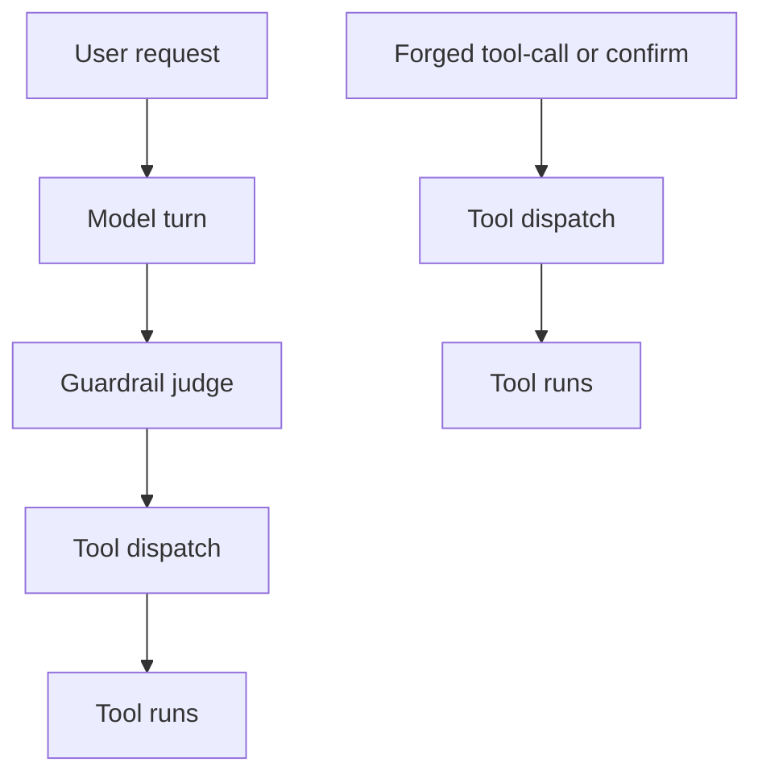

The dashboard said allowed. The tool already ran. The model never got a vote.

A guardrail that only watches the model turn cannot stop a call that never took that turn.

HiddenLayer showed the shared failure mode. OpenAI Guardrails’ jailbreak and prompt-injection detectors are LLM judges. In “Same Model, Different Hat” (10 October 2025), one injection hits judge and base model together. The judge stays under threshold. No alert. Same model class writes the answer and grades the risk.

CoreBreak showed the skip. Stealth showed it at Black Hat USA 2026. The CSA note (6 August 2026) records the pattern: a forged tool call or forged human confirm in message history reaches the harness. The pattern hit Bedrock AgentCore, Google ADK, and Vercel AI SDK harnesses. The model never runs. Every model-layer guardrail never gets a vote.

## Recommendations

- Require a verified model turn before dispatch.
- Bind tool arguments to that turn.
- Reject forged human confirms that do not match the recorded call.
- Alert on tool runs with no matching completion.
- Put any LLM judge on a different model class than the one it scores.
