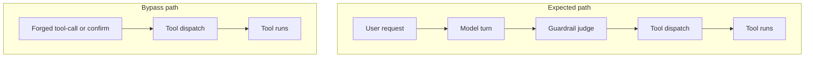

The dashboard said allowed. The tool already ran. The model never got a vote.

Teams buy guardrails as containment. A jailbreak detector, a prompt-injection judge, a content filter on the model turn: each lights green when the request looks clean. That green light is only as strong as the path it sits on. An attacker who co-opts the judge still gets a green light. An attacker who skips the model never meets the judge at all. In both cases the dashboard reads allowed after the tool has already run.

HiddenLayer showed the co-opt path on 10 October 2025. OpenAI Guardrails’ Jailbreak and Prompt Injection Detection pipelines are LLM-as-judge controls: a second model scores whether the input or tool traffic is adversarial. In “Same Model, Different Hat,” HiddenLayer shows that a single injection can hit the judge and the base model together. The bypass crafts the prompt so the judge emits a confidence just under the default threshold — for example 0.675 against a 0.7 cutoff — and no alert fires. The same class of model that generates the answer also polices itself. When both share the vulnerability class, the judge is not an independent gate.

The Cloud Security Alliance research note of 6 August 2026 describes the skip path. CoreBreak, presented by Stealth at Black Hat USA 2026, forged tool-call payloads and human-in-the-loop confirmations in message history so the harness dispatched tools without ever invoking the model. The pattern covers Amazon Bedrock AgentCore, Google’s Agent Development Kit, and Vercel AI SDK harness packages. Vendors assigned CVEs; the architecture residual is what matters here. The harness trusted payloads shaped like model tool calls without proving a real model turn. Every model-layer guardrail — system prompt, content filter, refusal training, LLM judge — never runs, because there is no model decision left to judge.

The residual is architectural, not a patch list. Teams treat prompt filters and LLM judges as containment. Tool dispatch still trusts shaped payloads and session history the agent — or the attacker — can author. A green guardrail on the model path cannot catch a call that never took that path. It also cannot catch a judge the attacker taught to score under the threshold.

Treat provenance at dispatch as the gate. Require a verified model turn, with arguments bound to that turn, before any tool runs. If you keep an LLM judge, put it on a different model class than the one it scores. Log whether a dispatch can be tied to a recorded completion, not only whether the payload looked well-formed.

## Recommendations

- Require session-bound proof that a tool call originated from a real model turn before dispatch.
- Reject forged human-in-the-loop confirmations unless tool ownership, confirmation requirement, and arguments match the recorded call.
- Do not treat LLM-as-judge guardrails as independent containment when the judge shares the base model’s vulnerability class.
- Alert on tool invocations with no corresponding model completion in the session record.
- Audit every SDK and runtime that infers authorization from message shape or process identity rather than verified provenance.
