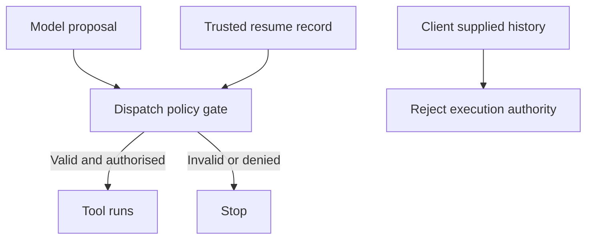

A guardrail result tells you what the guardrail inspected. It says little about a tool call that reached execution by another route.

HiddenLayer’s October 2025 research demonstrated a failure in LLM-based judging: adversarial content manipulated the safety evaluator as well as the model it was meant to supervise. The lesson is narrower than “guardrails do not work”. A model-based judgement remains vulnerable to manipulation and needs independent enforcement around consequential actions.

A separate architectural failure occurs when a harness accepts tool calls or approval events from untrusted conversation history. The CSA CoreBreak research note describes this class of bypass. If dispatch trusts an event that the client can manufacture, a filter attached only to a fresh model turn may never inspect the action.

These are different problems. One compromises a check; the other avoids it. Both require the platform team to examine the path from proposed action to actual execution.

The dispatcher should accept a tool proposal only from a trusted execution record, then authorise its action, resource and arguments. For model-originated calls, preserve the link to the recorded model output. For scheduled or resumed work, define an equally explicit trusted origin. A fresh model completion is not a universal requirement, and a genuine completion is not permission to act.

Changing the judge model may reduce shared failure modes. It does not make the judge independent of prompt injection, nor repair an execution path that skips the check.

## Recommendations

- Enforce action and resource policy at every dispatch route, including retries and resumptions.
- Keep execution and approval records in server-controlled state; never derive authority from client-supplied history.
- Bind the tool, arguments and target to the authorised request, and reject changes before execution.
- Test forged approvals, replayed calls and direct dispatch attempts against the deployed harness.
- Treat LLM judges as additional detection, backed by deterministic permission checks and scoped tool credentials.

Related pattern: [Verified Dispatch Path](/patterns/verified-dispatch-path/).
