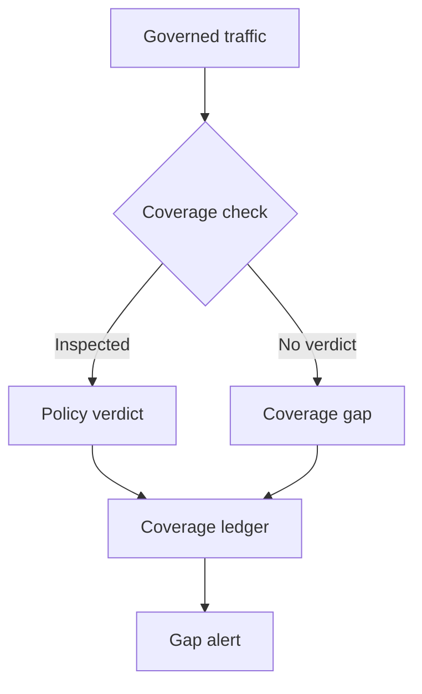

At 09:00, the security dashboard shows no denials. The policy server is throwing errors, and the configured failure mode is “allow.” No denials is an accurate count of the decisions it received; it is a poor answer to how much traffic it actually inspected.

This is an **operational failure scenario**, not a report of a compromise. It matters more as AI policy moves from advisory client hooks to provider-side interception. [Claude Enterprise Inference hooks](https://platform.claude.com/docs/en/manage-claude/inference-hooks) hold governed prompts for an external server's verdict before inference; with **Validate tool calls** enabled, they also submit covered tool-call frames before execution. That is a real inline control on its documented paths. Its assurance nevertheless depends on configuration, endpoint availability, coverage and an auditable denominator—not the mere presence of a hook URL.

## What an empty deny feed cannot tell you

[The configuration guide](https://platform.claude.com/docs/en/manage-claude/inference-hooks-configuration) distinguishes off, shadow and enforcing states. Shadow mode never blocks. A rollout below full inspection permits the unsampled turns without a verdict, even with fail-closed selected. Custom-role exclusions leave those members outside the hook. The first saved failure-handling default is **Allow the request**, so a timed-out or erroneous endpoint can let a governed request proceed uninspected. Rejected oversized bodies count as webhook failures: [the endpoint contract](https://platform.claude.com/docs/en/manage-claude/inference-hooks-endpoint) allows large transcript bodies, whereas common server body limits are much smaller. Sustained qualifying endpoint failures can trip a circuit breaker, after which the failure-handling choice applies while Anthropic stops sending the affected requests to the endpoint.

Telemetry needs careful reading. Under fail-open, the [Activity Feed records requests that proceeded without inspection because no verdict was obtained](https://platform.claude.com/docs/en/manage-claude/inference-hooks-configuration#audit-trail), but **while the breaker is tripped it does not record one event per affected request**; the trip event marks the window. Under fail-closed, failed requests are not individually recorded there either. The settings health panel is best-effort and may show zero failures if its counters cannot be read. A policy server's own logs necessarily omit traffic it was never sent. Thus “zero denials,” “no errors here,” and “we logged every request” are different propositions.

The trust boundary is **organization policy intent → platform enforcement state → permitted inference or tool execution**. A configured endpoint is not proof that a particular action passed inspection. The security owner should define which requests and tool classes require protection, then maintain a coverage ledger joining the configured mode, rollout, exclusions, tool-call validation, endpoint verdicts and platform activity to an independent workload count. Record transitions into off, shadow, fail-open and breaker states; page on missing coverage rather than only on malicious-content detections. Restrict who can change configuration and review those changes separately from endpoint code. Do not store full prompts just to get a denominator: aggregate counts and restricted correlation identifiers can be sufficient.

For high-impact data access or writes, choose **Block the request** if the business can tolerate the resulting outage, and keep a separate execution-side policy at the resource or tool gateway. [OWASP's AI agent guidance](https://cheatsheetseries.owasp.org/cheatsheets/AI_Agent_Security_Cheat_Sheet.html#tool-authorization-middleware) places action authorization in the execution component, outside the agent's context. A prompt hook cannot authorize the eventual recipient, parameters or current entitlement merely by allowing inference. Nor does the hook inspect raw image bytes, system prompts, every application or every tool call: the [published scope and limitations](https://platform.claude.com/docs/en/manage-claude/inference-hooks#current-limitations) must be in the coverage contract, not hidden in a dashboard footnote. This is not a claim that the provider promises universal interception.

## Try to make the dashboard look green

In a disposable organization and with harmless canary prompts, exercise a normal allowed request and an explicit deny first. Then delay the policy server beyond its configured verdict timeout, return a non-200 response, and submit a transcript above the server's accepted body size. Repeat with rollout below full coverage, shadow mode, an excluded role and tool-call validation disabled. Deliberately trip the breaker only in a controlled test with a recovery plan. For each case, compare platform activity, endpoint receipts and a separate count of attempted and completed canary work. The acceptance criterion is **no protected inference or side effect without an enforceable verdict**, or—where fail-open is deliberately accepted—a detectable, bounded coverage gap and no high-impact target action. A breaker trip must raise a window-level alert even though there is no per-request hook record for that window. Restore the configuration and verify a fresh canary gets an enforced verdict; do not infer recovery from the server's health check alone.

Independent workload accounting may be incomplete where a platform does not expose every request, and a fail-closed policy can block legitimate work during outages. Treat that as an explicit assurance and availability trade-off. Even perfect prompt coverage cannot see image-only content in an attachment or prove a later tool action was authorized. The goal is a defensible statement of *what was actually gated*, not a stronger claim than the evidence permits.

Implement [Verdict Coverage Accounting](/patterns/verdict-coverage-accounting/) to turn missing inspection into a measurable control failure.

## Recommendations

- Set explicit enforcement, failure, rollout and exclusion policy; alert on every change and breaker trip.
- Reconcile verdicts against an independent workload denominator; report coverage gaps separately from denial rates.
- Exercise timeout, oversized-body, shadow, sampling and excluded-role paths with harmless canaries.
- Put consequential tool actions behind their own execution-side authorization gate, even when prompt inspection is healthy.
