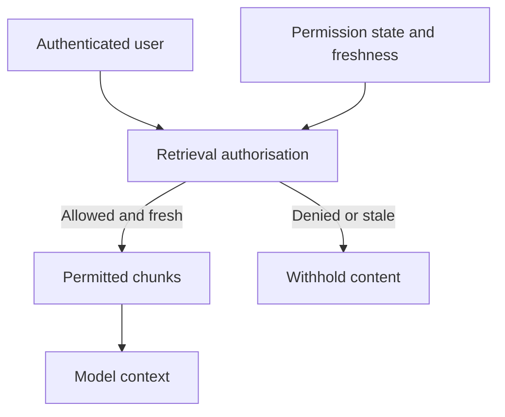

A user loses access to a restricted document. The source system refuses the next open request. The assistant can still answer from yesterday’s indexed copy.

The failure does not require prompt injection. It follows from keeping a second copy of both the content and its permissions, then treating that copy as current.

Microsoft’s Azure AI Search guidance makes the boundary explicit: native document-level checks evaluate the caller against permission metadata stored in the index. Changes at the source take effect after the relevant synchronization. The documented native ACL and sensitivity-label capabilities are in preview; support and refresh behaviour depend on the source and configuration.

A successful identity check therefore answers only part of the question. The retrieval layer also needs to establish which permission state it is using and how stale that state is allowed to be.

For a confidential workspace, a platform could attach a source identifier and permission version to every chunk, reject retrieval when permission synchronization exceeds an agreed age, and revalidate sensitive requests at the source. That is a proposed control design, not a claim that an index provides immediate revocation automatically.

Cached answers create another route. A response generated for one user must not become a shortcut around another user’s retrieval checks. Nor can removing a document from search erase text already placed in an agent’s conversation. Revocation handling needs to cover subsequent reuse of that context as well as fresh searches.

The operational measure is the time from source revocation to the last successful retrieval or cache reuse. “Permissions supported” is too weak an acceptance criterion.

## Recommendations

- Enforce access before restricted chunks enter model context, using the authenticated user’s entitlements.
- Carry source and permission metadata through document splitting and indexing.
- Define a maximum revocation delay, monitor synchronization and withhold affected content when freshness cannot be established.
- Scope answer caches to an authorization context and invalidate dependent entries when access changes.
- Test revocation across search, cached answers and resumed conversations; record the observed delay.

Related pattern: [Permission Freshness at Retrieval](/patterns/permission-freshness-at-retrieval/).
