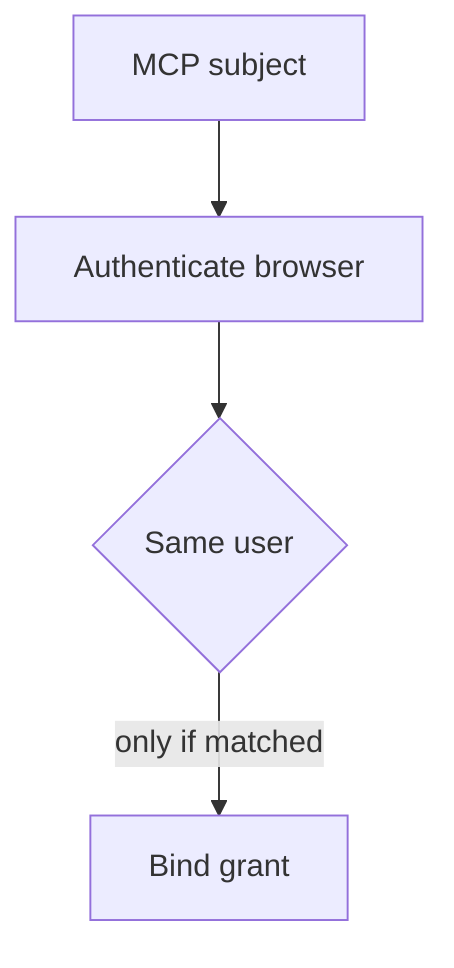

The credential never appears in the chat. The wrong person still gets the connection.

MCP URL-mode elicitation moves sensitive entry into a browser, away from the client and model. In the 2026-07-28 specification, a server can return a URL while processing a tool call; the client must show the full URL, obtain consent, and must not prefetch it. That protects one boundary: the client does not see the password or third-party token. It does not, by itself, prove that the browser user completing the flow is the same person who initiated the MCP request.

Consider a **hypothetical** shared integration server. Alice starts a tool call under her own MCP identity and receives a connect URL. She forwards it to Bob, who also uses that server, claiming Bob must reconnect his account. If the server stores pending authorization under Alice's request but accepts Bob's browser login and third-party OAuth callback without matching the browser identity to the initiator, Bob's third-party grant can be stored under Alice's account. Alice's later tool calls then use Bob's access. The MCP specification describes this phishing/account-binding failure mode explicitly; this is not a claim about an observed compromise of a particular product.

The trust boundary is the handoff from an authenticated MCP request to an out-of-band browser flow. A URL or callback state is a correlation handle, not proof of whose account should receive the resulting credential. The server must compare the authenticated subject that started the elicitation with the independently authenticated subject at the connect page before beginning third-party authorization, then bind callback state to that same subject. The protocol also forbids pre-authenticated URLs that themselves grant access to a protected resource.

Do not mistake a click on **Accept** in the client for completion of the browser transaction. The specification says that response only records consent to navigate; the server determines completion from its own state when the original request is retried. A misleading success message is not a binding check.

## Recommendations

- Record the initiating subject from server-verified MCP authorization when creating the pending request; do not accept a client-supplied email as identity.
- Serve a first-party connect page requiring browser authentication and match its subject to the pending initiator before redirecting to the third party. Protect callback state against substitution and replay.
- Show the full destination URL and server identity before navigation. Do not prefetch, shorten, auto-open, or collect third-party credentials in form-mode elicitation.
- Run a negative test with Alice's pending URL opened in Bob's authenticated browser. The page must reject before consent and no grant may appear on either account. Repeat with a modified URL and a replayed callback.
- Audit grant creation by initiator and browser subject without logging tokens or authorization codes.

A matched browser subject still cannot prove the human understood the third-party scopes. The consent screen and least-privilege grants remain separate controls; a legitimate user can approve too much.

Related pattern: [Same-User Elicitation Binding](/patterns/same-user-elicitation-binding/).
