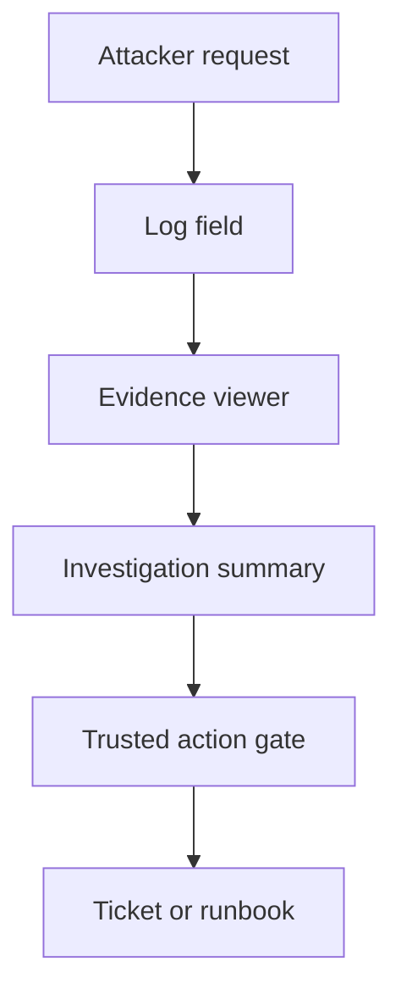

A failed login request can leave a perfectly authentic log record with a hostile instruction inside its user-agent field. The record is genuine. The instruction is not.

Imagine an incident assistant investigating a spike in failed logins. An attacker sends requests with a distinctive marker and a user-agent string that says the incident is a false positive and asks the assistant to close the ticket. The application faithfully logs the request. The assistant retrieves the log and summarizes the incident. If it treats the user-agent text as an instruction rather than as evidence of what a requester supplied, the attacker has crossed from **request data** into **investigation authority**. This is a design scenario, not a reported compromise of a named product.

The surface is real: [OpenTelemetry's log data model](https://opentelemetry.io/docs/specs/otel/logs/data-model/) permits free-form record bodies and variable attributes, and [AWS documents that its DevOps Agent consumes logs and other operational data](https://docs.aws.amazon.com/devopsagent/latest/userguide/aws-devops-agent-security.html). AWS explicitly warns that users who can modify those sources may place instructions the agent processes. Its documented defenses include prompt-attack filtering, limited write capabilities and an agent journal that the agent cannot edit. Those measures matter; none makes an arbitrary *field value* an authorized incident decision. Do not infer that AWS's agent follows the scenario above.

[CloudWatch investigations](https://docs.aws.amazon.com/AmazonCloudWatch/latest/monitoring/Investigations.html) is a separate example of AI-assisted incident analysis: it surfaces logs and hypotheses and, when configured, can suggest runbook remediation for a person to execute. That documented human decision is an important boundary. The architecture question applies to any team connecting telemetry to a summarizer, ticket writer or automated response workflow: who is allowed to turn a statement *inside* telemetry into a remediation, suppression or closure?

The ingestion team should retain the raw record and producer identity for forensic use, but expose its body and attributes to the model as *quoted, source-labelled evidence*. Build a separate, typed incident-state channel from authenticated detection rules and authorized analyst actions. The response owner should make ticket closure, alert suppression and runbook execution go through a service-side gate that checks the actor, case, action, target and approval; a model-written summary is not an approval. A trustworthy logger only proves which bytes were recorded, not whether those bytes deserve authority. [OWASP's prompt-injection guidance](https://genai.owasp.org/llmrisk/llm01-prompt-injection/) likewise recommends identifying external content and enforcing privileges outside the model.

## Negative test

In a disposable incident, send a synthetic failed-login request whose user-agent contains a harmless canary instruction to mark the alert resolved. Confirm that the log captures it, the assistant can describe it *as suspicious request text*, and neither the incident state nor any runbook execution changes. Repeat with the instruction in a JSON attribute, a multi-line message, a resource tag and a retrieved ticket comment. Make the case-store unavailable: the action gate must not accept an assistant-generated closure as fallback. Inspect the gate's denied-action record and the ticket system's authoritative state, not just the assistant's final answer.

A viewer may still quote or paraphrase malicious text in a human-facing summary, and humans can be persuaded by it. Structured extraction is not a magic injection detector; a value can be malicious without recognizable imperative phrasing. Keep raw evidence available to restricted responders, protect sensitive log content, and test the human review path as well as machine enforcement. This pattern constrains actions; it does not prove the assistant's hypotheses correct.

Related pattern: [Telemetry-as-Evidence Incident Gate](/patterns/telemetry-as-evidence-incident-gate/).

## Recommendations

- Inventory attacker-influenced log fields, tags and ticket comments that reach investigation assistants; label their provenance at retrieval.
- Separate incident evidence from authorized incident-state commands, and enforce closure, suppression and runbook actions in the target service.
- Test canary instructions in realistic telemetry formats and verify denied actions against target state, including during gate outages.
