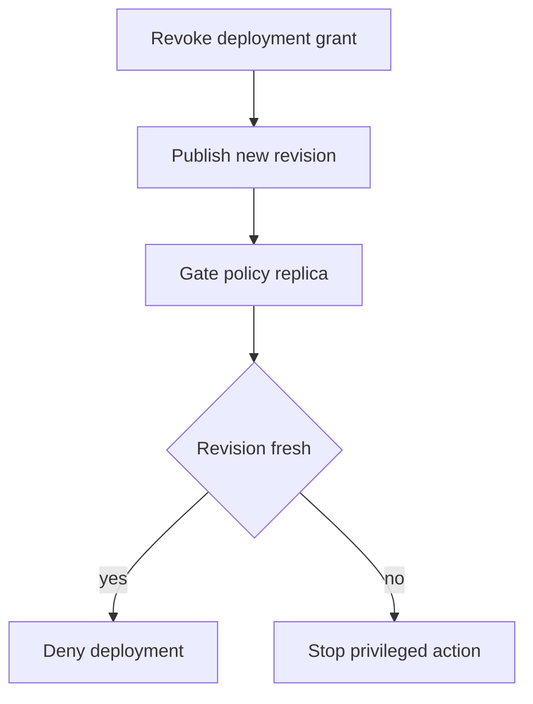

At 08:00, the security team revokes an agent's production deployment grant. At 08:01, one deployment gate still says yes. Which policy did it actually use?

Putting policy outside the agent is necessary, but distribution introduces another boundary: an approved *control-plane change* must become an effective *data-plane decision*. [Open Policy Agent's bundle documentation](https://www.openpolicyagent.org/docs/management-bundles) describes bundle propagation as eventually consistent. If a signed update fails verification, OPA continues with its existing bundle and reports an activation failure. That is a sensible availability behavior, but the **existing bundle can still allow the action the new policy was meant to revoke**. A valid signature establishes origin and integrity, not freshness. This is not a claim of a breach in OPA; it is a scenario an operator must design around.

Imagine a security operator revokes an automation agent's permission to deploy to production after a credential incident. A deploy gateway evaluates that agent against a local policy replica. A network partition, broken bundle or lagging replica leaves the old grant active while the control-plane UI displays the approved revocation. The attacker needs the still-valid agent credential and a route to the stale gate, not the ability to edit policy. The exploited boundary is between **revocation intent** and **the policy revision actually consulted before the target changes state**. The same timing concern exists in other authorization systems: [Amazon Verified Permissions documents eventual consistency](https://docs.aws.amazon.com/verifiedpermissions/latest/apireference/API_CreatePolicyTemplate.html) for changed elements.

The platform policy owner must publish an ordered revision and classify revocations that require immediate effect. The deployment service owner must enforce a maximum acceptable policy age **at the final action boundary**. For urgent revocations, require positive acknowledgement from every serving gate or suspend high-impact actions until they acknowledge; a remote freshness check or independently enforced emergency deny can close the gap when replicas are offline. Check both the revision and the current entitlement state if grants are stored separately. Do not allow an old cached `allow` to survive a new deployment request.

[OPA status reports](https://www.openpolicyagent.org/docs/management-status) expose the active revision, last successful activation and activation errors. Use those signals to compare the intended revision with each gate actually serving traffic. [OPA decision logs](https://www.openpolicyagent.org/docs/management-decision-logs) can include the bundle revision and decision ID; join those with the deployment service's operation record. Status is not proof that a particular action used the current rule, and a policy decision is not proof that the target deployed anything. The service must record both the revision it enforced and the target outcome.

## Negative test

Approve a deployment as an agent, then revoke that agent's grant and deliberately prevent one gate from receiving the update. Submit the *same otherwise-valid deployment* through that gate using the agent's still-valid credential. It must not proceed after the defined revocation deadline; capture the gate's active revision, freshness verdict, decision identifier and target's unchanged state. Repeat with a bad bundle signature, a restarted gate loading a persisted old bundle, and a rollback to an earlier revision. A passing test that merely sees the new policy in the central UI has not exercised the boundary.

A maximum-age rule permits a measurable exposure window, not instant revocation; synchronous checks trade availability for stronger timeliness and can fail during outages. Keep a separately controlled emergency block path and rehearse how to restore service without silently reactivating old grants. The architectural promise should be precise: either bound the delay and measure it, or stop privileged changes while freshness is unknown.

Related pattern: [Revocation-Aware Policy Gates](/patterns/revocation-aware-policy-gates/).

## Recommendations

- Require the deployment gate to check its active revision against the revocation deadline before dispatching privileged actions.
- Alert on serving replicas that have not activated the approved revision; retain both the gate's decision and the target's outcome.
- Rehearse a partitioned replica, invalid bundle, restart from a persisted bundle and rollback rather than relying on a central policy dashboard.
