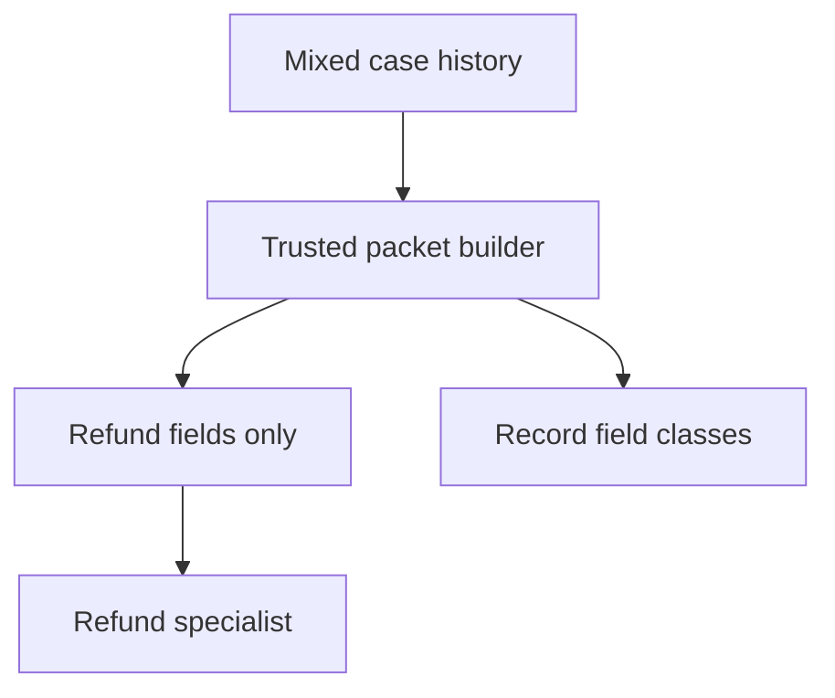

The refund specialist needed an order number. The handoff supplied the entire support conversation, including an earlier identity document and a tool result containing another customer's address. The specialist answered the refund question correctly; the disclosure happened *before* it answered.

This is a **design scenario**, not a reported incident in an agent framework. A team might isolate specialists by assigning different tools or prompts, yet still feed one specialist another's complete working history. In the [OpenAI Agents SDK handoff model](https://openai.github.io/openai-agents-python/handoffs/), the receiving agent sees the previous conversation by default; `input_type` validates handoff *arguments*, not the receiving agent's main input. An `input_filter` can change that history. In a different orchestration shape, [LangChain subagents](https://docs.langchain.com/oss/python/langchain/multi-agent/subagents) start with an isolated task description by default, but the parent can explicitly pass its message history. These are different defaults, not a claim that either product automatically leaks data across customers.

Suppose a support coordinator handles billing and identity-verification cases in one conversation. A customer-controlled message asks the coordinator to consult a refund specialist, and the coordinator hands off. If the specialist uses a different model provider, retention policy or operational team, handing over prior messages—including tool output that was legitimate for verification—crosses a *data-recipient boundary*, even if the refund tool itself is correctly scoped. A malicious customer could try to induce that route to move sensitive context into an answer or a downstream call. The simpler failure is unintentional over-sharing at transfer time. A final-answer filter cannot undo the model's exposure to the data.

The orchestration owner should define a per-destination data contract: the authenticated case ID, a server-fetched order reference, allowed issue category and the minimum customer request needed to answer. Build that packet in trusted application code from fields with known provenance. Do not ask the coordinator model to summarize a mixed transcript and treat its summary as a privacy boundary; it can copy secrets, paraphrase them or launder instructions from low-trust messages. A schema constrains shape, not whether the values are authorized. Recheck each field against the receiving specialist's purpose and tenant, and pass opaque references where the specialist can retrieve narrowly scoped data under its own authorization.

[SDK handoff filtering guidance](https://openai.github.io/openai-agents-python/handoffs/) warns that removing structured tool items does not remove arguments or results already copied into ordinary messages or nested-history summaries. Filtering `input_items` alone before generating nested history can leave excluded content in the summary. Server-managed conversations do not support handoff input filters; use a separate run with explicitly selected input and **do not reuse** the original conversation or previous-response ID when that boundary matters. Verify the *actual recipient input*, not merely the filter's return value or the coordinator's intended payload. The [SDK results surface](https://openai.github.io/openai-agents-python/results/) distinguishes input used after filtering from the full rich run items, useful for checking the boundary without publishing sensitive transcripts.

## Negative test

Place unique harmless canary strings in a verification-only tool result, an ordinary message quoting that result, and a previous nested summary. Trigger the refund handoff via a customer-controlled message. Capture the exact specialist model input at the provider boundary; none of the canaries or raw identity fields may appear there, and the specialist must still have enough permitted order context to complete a normal refund inquiry. Repeat with a server-managed conversation, a model-generated handoff argument containing a canary, and a second handoff. Deliberately make the packet builder unable to look up the authorized order: it must stop rather than fall back to the full transcript. Keep test captures access-controlled and free of real customer secrets.

This design does not make a receiving specialist safe once authorized data arrives. It can still mishandle permitted fields, and prompts can still induce harmful actions. [Agent-level input guardrails run only on the first agent in an SDK chain](https://openai.github.io/openai-agents-python/guardrails/); put authorization at each consequential tool boundary, and treat output checks as an additional safeguard, not a substitute for limiting the handoff. Access to earlier history may be genuinely necessary for some cases; document that exception and apply the same recipient-specific review.

Related pattern: [Purpose-Bound Handoff Packets](/patterns/purpose-bound-handoff-packets/).

## Recommendations

- Inventory receiving agents, model providers and transcript fields; define a minimal packet contract for each handoff.
- Construct the packet from authorized application data, not a model-written transcript summary, and verify the final recipient input.
- Test copied tool results, nested summaries and server-managed histories; fail closed when the authorized packet cannot be built.
