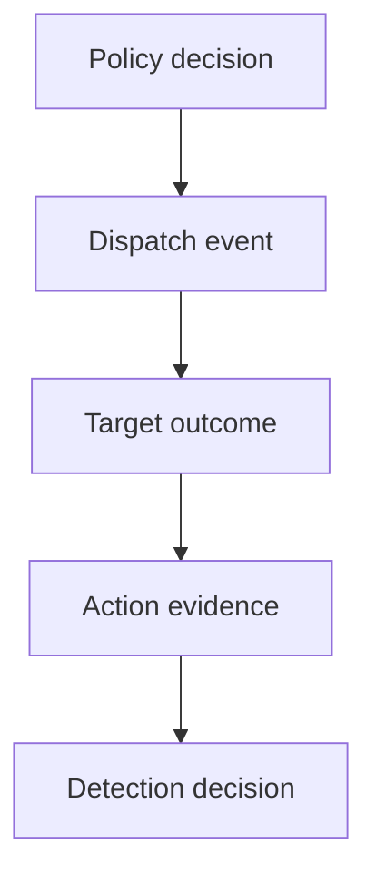

The agent trace says the tool call succeeded. The target says the record never changed. Which one is wrong?

Possibly neither. The agent may mean that it received a response. The gateway may mean that it forwarded an authenticated request. A queue may mean that it accepted work. Only the target can report whether the intended state changed, and even that record does not prove the earlier policy decision was valid.

This semantic gap weakens both detection and response. A rule looking only for failed calls misses a successful request with a harmful effect. A rule looking only at target changes cannot explain which agent, instruction or approval caused them. During an incident, responders are left matching timestamps and payload fragments across systems that use different identities.

Distributed tracing helps carry an interaction identifier across services. It does not make the trace identifier trustworthy, turn spans into audit evidence or establish that a side effect happened. W3C Trace Context explicitly treats trace data as information that crosses trust boundaries. A caller-supplied identifier must therefore be validated or replaced at the first trusted boundary, then bound to authenticated local identities.

The useful detection object is not a single log line. It is a joined action record: what was requested, what policy decided, what was dispatched and what the target observed. Missing stages are themselves signals. An allowed dispatch without a decision record is a control gap. A dispatch with no target result is unresolved, not successful. A target change with no recognised dispatch may indicate a bypass.

The join also gives response teams something concrete to reconcile. They can distinguish a rejected request from a queued action, a completed change and an unknown outcome before choosing containment or recovery steps.

Visibility is complete only when the organisation can explain the action across the boundaries that executed it.

## Recommendations

- Define distinct states for requested, allowed, dispatched, accepted, completed, denied and unknown.
- Issue an operation identifier at the first trusted gateway and map external trace identifiers to it.
- Join agent, policy, gateway and target records while retaining the source and confidence of each field.
- Alert on missing or impossible sequences, including target changes without a recognised dispatch.
- Test correlation with delayed, duplicated, reordered and absent events before relying on it in response.

Related pattern: [Cross-Boundary Action Evidence](/patterns/cross-boundary-action-evidence/).
