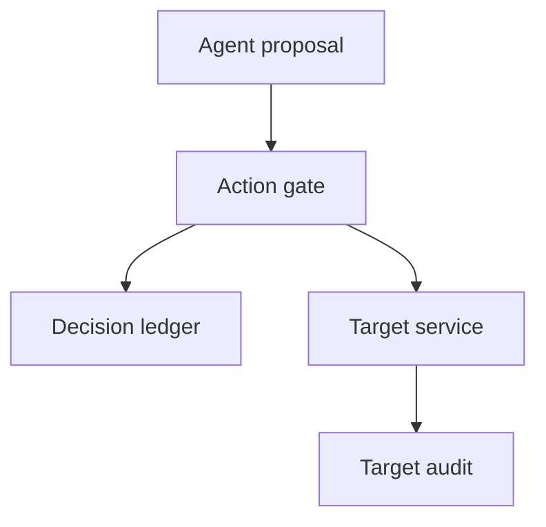

The operator searched for the agent's denied export. The trace dashboard showed nothing, although the policy gate had rejected the call. The absence looked reassuring until someone checked the sampling configuration.

This is a **design scenario**, not an observed incident or a claim about an OpenTelemetry deployment. Imagine an agent attempting to export a customer report. A gateway denies the export, but the application emits the denial only as a span event. The service uses head sampling for ordinary traffic, so this trace is never recorded or exported. A downstream tail sampler configured to retain error traces cannot recover a span that was already dropped upstream. Worse, if the target has another route that actually processed the request, a dashboard search for a denied trace cannot establish whether the export did or did not happen.

[OpenTelemetry distinguishes sampled from unsampled traces](https://opentelemetry.io/docs/concepts/sampling/): unsampled spans are not processed or exported. Its [tracing SDK defines `DROP` as discarding span attributes and events](https://opentelemetry.io/docs/specs/otel/trace/sdk/). Head sampling decides before the whole trace is visible; tail sampling can use later error information only from telemetry it receives. [Collector filtering can also drop matching telemetry](https://opentelemetry.io/docs/collector/transforming-telemetry/). These are legitimate cost and governance tools. The boundary fails when a team silently treats *observability designed to be incomplete* as the authoritative record of every security decision.

The control belongs at the action gate and target, not in an agent prompt or a tracing sampler. The gateway owner should issue a server-generated operation ID and write a small, access-controlled **decision receipt** for every consequential request: authenticated actor, action, resource reference, policy version, decision, and time. The target owner should record acceptance and final side effect under the same operation ID. For a denial, the gateway must prevent dispatch; the target's audit is needed to detect any bypass. For an allow, a decision receipt alone is not proof of completion. Reconcile gateway receipts with target outcomes and alert on target changes without a recognized receipt, dispatched calls without an outcome, and gaps in the ledger's own sequence or availability. Never rely on a model-supplied trace ID as identity.

This is deliberately narrower than recording every prompt or tool argument. [OWASP separates security-event logging from other audit and transaction trails](https://cheatsheetseries.owasp.org/cheatsheets/Logging_Cheat_Sheet.html) and advises testing logging failures, protecting logs against tampering and excluding sensitive data. Encrypt and restrict the receipt store; avoid report contents, tokens and personal data in the ledger. If the receipt store is unavailable, the high-risk action path should stop or use a formally scoped break-glass route with its own independent audit. Low-risk read-only operations may warrant a different availability trade-off; document it rather than implying universal fail-closed logging.

## Negative test

In a disposable environment, set trace head sampling to drop the test agent's trace, then submit a denied export with a unique operation ID. Confirm that the dashboard has no trace **but** the decision ledger retains the denial and the target audit has no export. Submit an approved export through the normal gate and verify the matching target-side outcome; try a direct target API call with the agent's identity and assert that it fails. Finally, disconnect the ledger and repeat the high-risk request: no export should occur and the failure should surface to operators. Do not conclude that an absent target audit entry proves non-execution if target auditing itself is broken; cross-check the target's state in this test.

A ledger can be incomplete or forged if the gateway identity, storage permissions or target audit is compromised. Sampling is still useful for performance investigation, and even complete receipts do not reveal an agent's intent. The assurance claim is limited: when the gate and target are independently controlled and reconciled, a missing trace no longer erases the evidence needed to test whether an action was authorized and executed.

Related pattern: [Unsampled Action Receipt](/patterns/unsampled-action-receipt/).

## Recommendations

- Classify consequential agent actions and require a gate-owned decision receipt before dispatch, independently of trace sampling.
- Join each receipt to a target-owned outcome using a server-issued operation ID; investigate unmatched target changes and missing outcomes.
- Test dropped traces, collector filtering, ledger outage and direct target bypass while checking actual target state.
