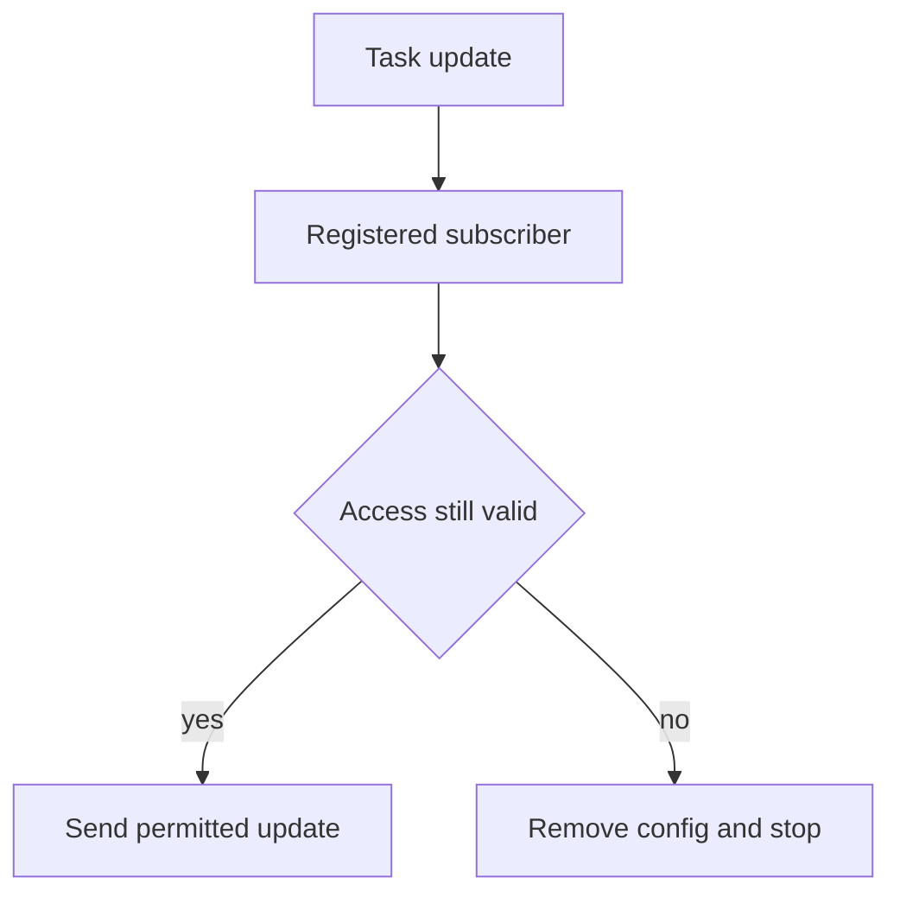

The investigator loses access to the case at noon. At 12:01, the case agent posts another update to the investigator's webhook. The access review says the removal succeeded. The notification queue disagrees.

This is a **design scenario**, not a reported A2A breach. The [A2A 1.0 specification](https://a2a-protocol.org/v1.0.0/specification/) lets a client register a push configuration for a task, including a webhook URL. The configuration persists until task completion or explicit deletion; the server sends task updates to that URL. A [push notification can contain a task, message, status update or artifact update](https://a2a-protocol.org/latest/topics/streaming-and-async/). Authenticating the HTTP recipient and checking that the URL is safe to contact do not answer whether that recipient is **still entitled to this task's updates**.

Suppose a contractor is temporarily authorized to follow a sensitive incident task. They register a webhook they control. When the incident owner removes the contractor's access, the agent service revokes `GetTask` permission but leaves the push configuration in its notification store. A later artifact or status update is delivered to the old webhook without another read request from the contractor. The attacker needs neither a guessed task ID nor a new prompt: the previously valid subscription is the capability. The trust boundary is the promotion of a registration-time entitlement into an ongoing disclosure channel.

The [Python SDK's push-config store contract](https://a2a-protocol.org/latest/sdk/python/api/a2a.server.tasks.push_notification_config_store.html) makes the implementation boundary visible: caller-facing reads are owner-scoped, but the internal dispatch path retrieves configurations across owners and says authorization already happened at registration. That is not proof of a flaw in any deployment. It does mean a deployment whose authorization can change must decide what happens *between registration and delivery*. A `GetTask` check on each incoming request cannot protect an outbound POST made later by the server.

The task-service owner should bind each registration to a server-derived subscriber principal, tenant, task, allowed update class and entitlement revision; never treat the webhook URL or a client-supplied token as the identity. The notification dispatcher should re-evaluate current access just before dispatch, or require a short-lived lease invalidated by revocation with an explicit maximum delay. If the policy store is unavailable, hold sensitive notifications rather than sending under an unbounded old grant. On revocation, remove pending configurations and queued deliveries for that subscriber; make the enqueue-to-send transition atomic with an authorization check or a revocation fence so an already queued update cannot escape after the deadline. Keep a bounded audit record of the registration, access decision, queue transition, delivery attempt and recipient without logging notification bodies or credentials.

## Negative test

Authorize subscriber A to an incident task, register A's webhook and confirm one permitted update arrives. Revoke A while the task continues, then emit an artifact update containing a unique harmless marker. A's webhook must receive **zero** post-deadline deliveries, even if the update was queued before revocation; another still-authorized subscriber B must continue to receive it. Repeat during a policy-store outage, after a worker restart with persisted configurations, and while a retry waits in the queue. Compare entitlement revision, registration owner, queued event ID, send-time decision and webhook receipt. Merely proving A's next `GetTask` is denied does not exercise this boundary.

Immediate revocation requires a coordinated fence across queues and workers; a lease-only design permits a stated exposure window. A remote recipient may retain earlier notifications, and a webhook can forward them elsewhere. The server can stop *future* disclosure, not recall already delivered content. Keep payloads minimal, and test the actual recipient, not just the dispatcher's logs.

Related pattern: [Revocable A2A Push Subscribers](/patterns/revocable-a2a-push-subscribers/).

## Recommendations

- Treat each push configuration as a revocable, task-scoped subscription rather than a one-time URL approval.
- Enforce current subscriber authorization at send time and fence queued or retried deliveries on revocation.
- Reconcile the send decision against webhook receipts; test revoked subscribers with real artifact updates, not only denied task reads.
