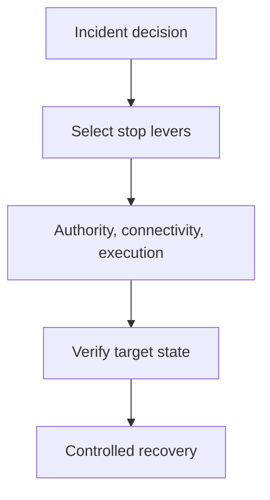

An instruction to stop is not a kill switch.

Neither is a red button wired to one service. An agent can stop generating responses while a queued job continues, a delegated agent finishes its task, or an issued credential remains valid. The interface looks contained because the part being watched has stopped. The capability to cause harm has not.

For incident response, the useful question is not "where is the kill switch?" It is "which abilities must this incident remove?" Three independent pillars provide a practical answer.

**Authority** removes permission to act. Revoke workload credentials, delegated grants, connector consent and tool entitlements. Deny new actions at the enforcement point. This is often the strongest lever for a SaaS agent that the organisation cannot terminate directly. It is weaker where bearer tokens remain valid, permissions are cached or tools have an ungoverned route.

**Connectivity** removes the path to act. Block egress, disable MCP or A2A routes, isolate a host, close a tool gateway or restrict a target endpoint. Preserve a separate management and evidence path. Network isolation alone does not stop local actions, already accepted work or a remote worker that received the task earlier.

**Execution** removes the thing doing the work. Stop the process, container or service; pause the scheduler; fence the queue; disable the agent in its control plane. This is essential when the runtime itself may be compromised. It does not invalidate copied credentials or reverse an external side effect.

These are not maturity levels and they do not have a universal order. A low-impact internal assistant may need authority withdrawal and connector isolation. An endpoint agent may require process termination, network isolation and token revocation together. A high-impact autonomous service should have all three, operated outside the agent's control.

A2A illustrates why the distinction matters. Its cancellation operation asks the server to attempt cancellation and explicitly says success is not guaranteed. Cancellation is an execution signal. It is not proof that descendants stopped, credentials lost authority or external effects were contained.

Monitoring is not a fourth kill pillar. It is the evidence layer across all three. Responders need to see which control was invoked, whether enforcement points accepted it, which work was already in flight and whether target systems still observe activity. Without that verification, a kill switch is only a command sent.

The kill switch is therefore a tested response capability, not a product feature.

## Recommendations

- Map authority, connectivity and execution controls for every agent use case before production approval.
- Keep containment controls and responder access outside the agent's administrative and execution boundary.
- Define which pillars are mandatory by autonomy, data sensitivity, exposure and business impact.
- Reconcile queued work, delegated tasks, credentials and target-side effects before declaring containment.
- Exercise partial failure: assume one control is unavailable, delayed or falsely reports success.

Related pattern: [Three-Pillar Agent Containment](/patterns/three-pillar-agent-containment/).
