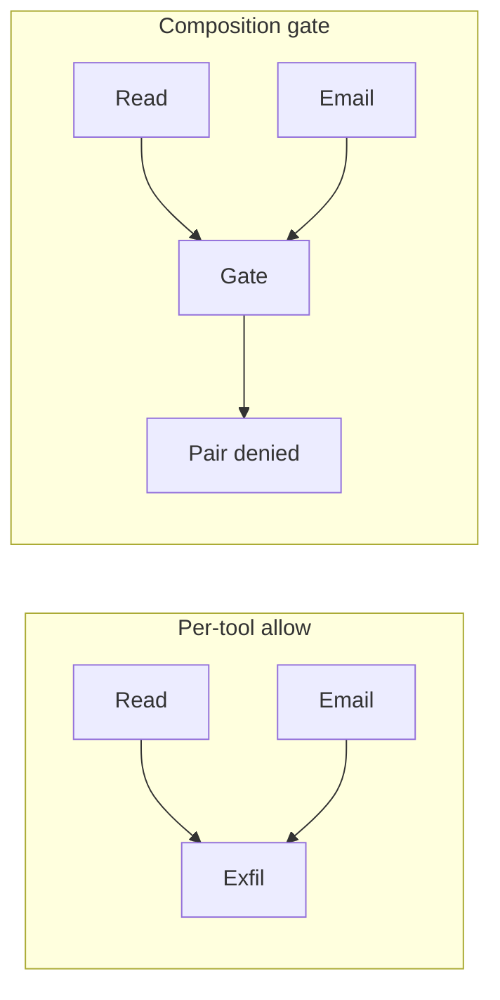

An agent can be allowed to read confidential files and also to send external email. Each permission is fine on its own, but together they can still leak the files. That is a confused-deputy problem.

Checking each tool call against a list of allowed tools is not enough, because each call can stay inside policy while the session is still the attack. The missing control is a rule about pairs: if the session has already read a confidential file, it must not also send that file out. Muruaga’s Bounded Agents paper names this composition closure: prohibited pairs are checked against what the session has already done, and that check runs outside the model.

Prompt injection matters here because the pair of tools can still run. If the infrastructure refuses the pair, the injection cannot finish the theft: the model can still be manipulated, but the pair cannot run.

When one agent hands work to another, the second should not gain more power than the first, so blast radius should shrink along that chain and never grow. AWS has a Cedar sample for agents that hand work down a chain, and it makes the same structural point: at each hop, permissions only narrow.

If your allowlist is a list of tools, you have described the parts. You have not described the session.
