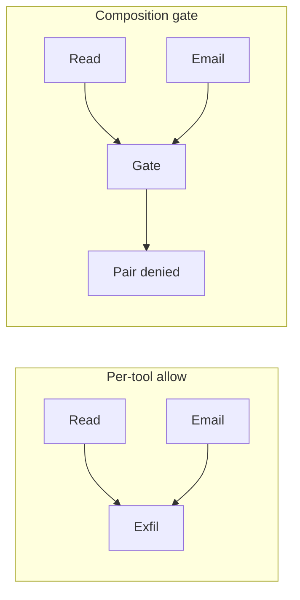

An agent allowed to read confidential files and send external email can combine them into exfiltration without violating either permission. That is confused deputy at the level of action composition.

Per-action authorization is structurally insufficient. Each tool call can be in policy while the session is the attack. The missing control is composition closure: prohibited combinations evaluated over session history, outside the model.

Prompt injection's security consequence is largely this architecture problem. If the combination cannot execute at the infrastructure layer, the injection cannot complete the theft. The model can still be manipulated. The pair cannot run.

Blast radius should only shrink down a delegation chain, never expand. AWS's Cedar sample for agentic delegation makes the same structural point: at each hop, permissions only narrow.

If your allowlist is a list of tools, you have described the parts. You have not described the session.
