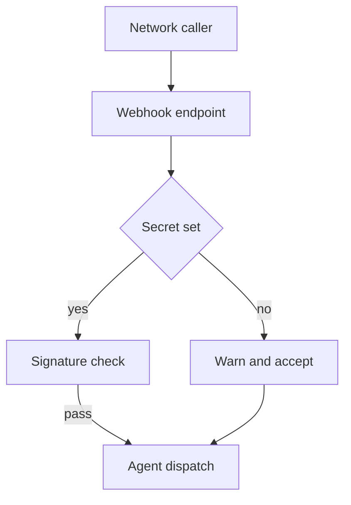

A signature check that only runs when a secret exists is not a deny posture. It is a skip.

Agent stacks often ship webhook receivers that verify HMAC or Bearer tokens correctly when configured. The failure mode is quieter. When the secret environment variable is unset, the default on a fresh install, the code takes the `if secret` branch that never enters verification. The request is still parsed. The payload is still trusted. Operators may see a single warning in the log and assume the boundary is “optional until production.” Network callers who can reach the endpoint do not need that assumption. They need only the open path.

In June 2026, `nextcloud-mcp-server` published `GHSA-8vh3-g2qg-2h2c` (CVE-2026-55640). Through 0.117.1, `WEBHOOK_SECRET` defaulted to `None` and startup did not require it. `handle_nextcloud_webhook` gated auth with `if secret`. When unset, it logged once and still processed the body. The attacker-controlled `user.uid` field drove Qdrant deletes and re-index work for any user. No credentials were required on a reachable port. The 0.117.2 fix fails closed: no secret means the route is unavailable or returns 503, and a missing Bearer fails with 401.

The same month, PraisonAI published `GHSA-x92v-rpx6-p6cw` for its WhatsApp and Linear bot adapters. `WHATSAPP_APP_SECRET` and `LINEAR_WEBHOOK_SECRET` default to empty. Both `_handle_webhook` paths wrap signature verification behind a truthy-secret guard (`_app_secret` for WhatsApp, `_signing_secret` for Linear). When the secret is absent, HMAC is never consulted and the forged event is dispatched into the agent as a real platform message or issue event. The signature routines themselves are sound. The residual is the missing-secret skip. Patched builds from 4.6.59 refuse that open path.

Treat “webhook auth supported” as a containment claim only when missing configuration fails closed. Require the secret at startup for any public receiver, reject unsigned traffic when it is absent, and keep a named insecure override out of default installs. Otherwise the residual is an open control plane that looks like a policy gap and behaves like no gate at all.

## Recommendations

- Fail closed when a webhook signing secret is unset: refuse startup or return 403/503 before parsing the body.
- Inventory agent bots and MCP receivers for `if secret` guards that skip verification on empty defaults.
- Keep signature verification on the raw body; do not treat a log warning as a control.
- Prefer loopback or private network binding until the secret is set and tested.
- Separate “auth implemented” from “auth enforced” in risk language until missing-secret paths are proven closed in CI.
