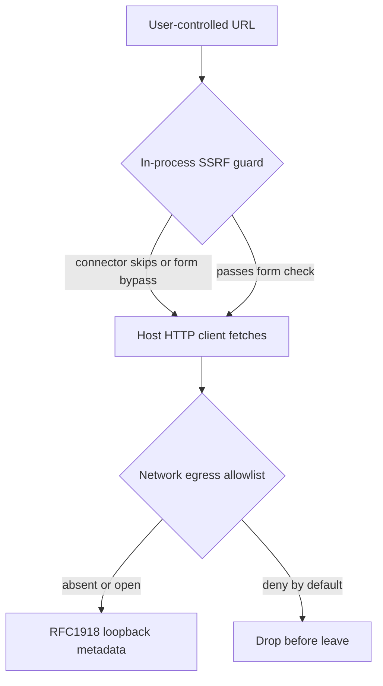

Agent platforms that fetch user-controlled URLs often ship a private-IP check in application code. That check is not egress control.

Egress is a property of where packets may leave. An in-process validator answers a narrower question: does this string look like a blocked destination before this particular HTTP client runs? Those answers diverge whenever a connector skips the helper, a parser disagrees with the client, or an address form is not normalised. The residual is the same in both cases. The host still has a route to RFC 1918, loopback, and cloud metadata. The agent inherits that route.

On 8 September 2026, IBM published a Langflow OSS bulletin covering missing egress validation on server-side URL fetches (including CVE-2026-12767). Connector and MCP configuration fields accepted HTTP or HTTPS targets that included private, loopback, and metadata addresses. Some paths never called the shared SSRF guard. One public flow-build path could trigger fetches without authentication. Patching to 1.11.6 closed the app-layer holes. It did not invent a network allowlist the process lacked.

AutoGPT Platform hit the same category from the other side. GHSA-8qc5-rhmg-r6r6 (CVE-2026-56663), fixed in 0.6.52, covered `SendWebRequestBlock`. The helper `_is_ip_blocked()` compared resolved addresses to IPv4 deny ranges without normalising IPv4-mapped IPv6 forms such as `::ffff:169.254.169.254`, and omitted CGNAT `100.64.0.0/10`. A hostname under attacker DNS control passed the validator and reached the embedded internal IPv4 endpoint. The residual was not a missing string match. It was treating an incomplete address list as if it were egress policy.

Treat every agent fetch primitive as a privileged egress capability. Put deny-by-default destination policy at the network or egress proxy, not only in the language runtime. Prove that metadata and private ranges fail closed even when the app validator is wrong or missing. Otherwise the residual is a green path from a trusted agent host into whatever that host can already reach.

## Recommendations

- Enforce deny-by-default egress for agent and workflow hosts at the network or proxy layer, independent of application URL helpers.
- Block RFC 1918, loopback, link-local, CGNAT, and cloud metadata destinations from agent workers even when in-process validators claim to filter them.
- Inventory every connector, MCP config URL, and “test connection” path that performs a server-side fetch; require the same egress gate on all of them.
- Normalise IPv4-mapped IPv6 and dual-stack resolution before any app-layer IP comparison, and still fail closed at the network if that code is wrong.
- Prove in tests that a hostname resolving to `169.254.169.254` via mapped IPv6 never leaves the host when the app guard is bypassed or removed.
