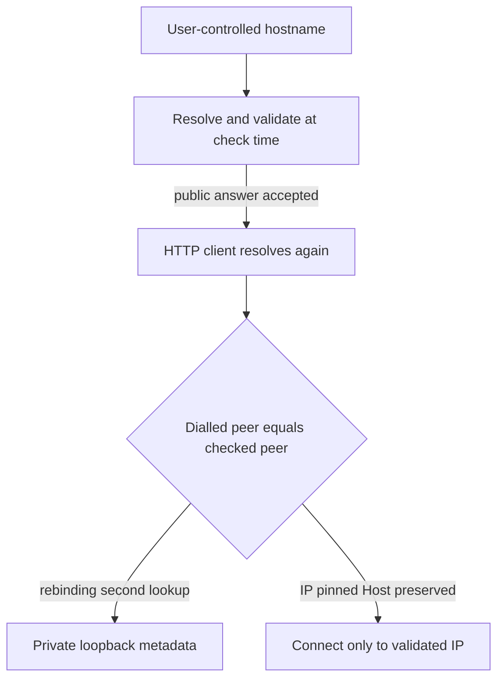

An SSRF helper that resolves a hostname, accepts a public answer, then lets the HTTP client resolve again is not a closed gate.

Check-time DNS and dial-time DNS are different moments. A name under attacker control can answer with a public address while the validator runs, then answer with loopback, link-local, or cloud metadata when the client opens the socket. The residual is not a missing private-IP string. It is treating a separate lookup as if it were the same peer.

LangChain hit that pattern in `langchain-openai` before 1.1.14. GHSA-r7w7-9xr2-qq2r (CVE-2026-41488) covered `_url_to_size()`, used when counting image tokens. The helper called `validate_safe_url()` and then fetched with an independent `httpx.get()`. A rebinding hostname could pass the check and reach a private target on the second resolve. Impact on that path was limited because the body went only to Pillow for dimensions, not back to the caller. The architectural residual still stands. The fix moved to `SSRFSafeSyncTransport`: resolve once, validate every returned address, pin the connection to a checked IP, and refuse redirects that reopen the window.

IBM published the same residual on Langflow OSS as CVE-2026-10546. The URL component called `validate_url_for_ssrf()` and then loaded through `RecursiveUrlLoader`, which performed its own DNS resolution. Maintainers had already closed the identical class in `api_request.py` with `validate_and_resolve_url()` plus `SSRFProtectedTransport`. That pin did not land on the URL component until 1.10.0. Two products, two codebases, one failure mode: validate, then fetch, without binding the dial to the checked peer.

Treat every agent or workflow fetch as a privileged dial. Resolve once, validate the full address set, and connect to a pinned IP. Keep the original Host header and TLS server name for certificate checks. Re-validate every redirect hop with the same pin. Prefer disabling redirects on these paths. Pair that with deny-by-default network egress so a missed pin still fails closed. Otherwise the residual is a green app-layer check and a socket that lands somewhere the check never saw.

## Recommendations

- Replace validate-then-fetch helpers with resolve-once transports that pin the connection to a validated IP and preserve Host and SNI for TLS.
- Block private, loopback, link-local, CGNAT, Kubernetes internal DNS, and cloud metadata addresses on every resolved answer, not only the first.
- Disable automatic redirects on agent fetch paths. If redirects must stay, re-run the same resolve-validate-pin sequence on each hop before following.
- Inventory token-counting, preview, crawl, and “load URL” helpers that open sockets outside the shared SSRF transport.
- Prove in tests that a hostname answering public then `169.254.169.254` on the next lookup never completes a dial when the pin is removed.
