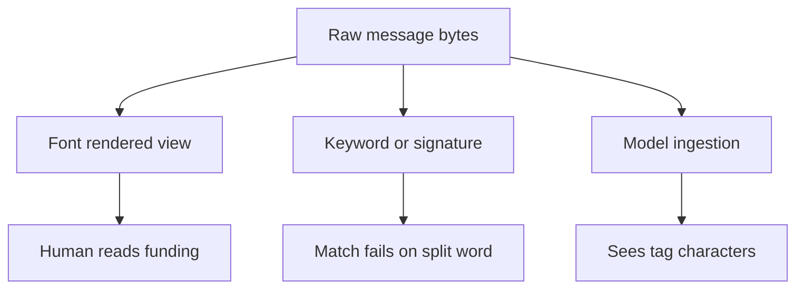

The word on the screen is not the byte sequence the filter matches. The residual is treating font-rendered text as the security surface.

On 3 September 2026, Microsoft Security Research (Noam Kochavi and Sarah Wolstencroft) showed that invisible Unicode Tag characters in the range U+E0000–U+E007F had crossed from AI prompt-injection research into high-volume phishing. Attackers spliced a TAG SPACE (U+E0020) into finance lure words so that `funding` arrived as fun⟨U+E0020⟩ding. Recipients still saw a normal word. Literal keyword and signature matches that expected a contiguous string failed, and tokenizers that split on the unexpected code point no longer saw the familiar unit. Signature hits in Microsoft Defender for Office 365 telemetry jumped from roughly twenty-one thousand messages on 8 February 2026 to more than 1.3 million the next day, peaked above 2.3 million, and clustered around about one hundred fifty disposable finance domains relayed through ActiveCampaign. Layered MDO protections still caught most of that mail without depending on a Unicode-only signal, which is the right architecture: normalize before match, and keep reputation and URL layers in the stack.

Fortra’s earlier reporting on the same ActiveCampaign-delivered SBA and finance phishing campaign is the independent second venue. That write-up documented AI-generated line-of-credit lures harvesting business and financial details before the Unicode-tag phase appeared in Microsoft’s telemetry. Microsoft explicitly ties the later evasion to that broader campaign. The technique choice is what changed; the delivery path and lure class were already live.

The same property that breaks a detector also smuggles instructions to a model. Tag characters do not render in typical fonts and UIs, yet they remain in the raw text any assistant that ingests email, a document, or a web page will process. Embrace The Red’s ASCII Smuggler tooling and MITRE ATLAS AML.T0068 (LLM Prompt Obfuscation) made that gap famous for prompt injection. This campaign inverted the intent: hide the lure word from the filter while leaving it readable to people. One surface, two victims.

If your control evaluates the string a person would read aloud, you are evaluating the wrong surface. Strip or fold Tag-block and other invisible code points before keyword, signature, and tokenizer stages, and apply the same normalization before any model reads the message. Treat rare Tag-block density itself as an anomaly, not as proof that the rendered lure was clean.

## Recommendations

- Normalize U+E0000–U+E007F and other invisible Unicode out of subjects and bodies before keyword, signature, or regex evaluation.
- Run the same normalization before AI assistants ingest email, documents, or page text.
- Treat unexpected Tag-block density as a high-value anomaly signal, excluding known legitimate uses such as subdivision flag emojis.
- Keep layered mail controls (sender, URL, brand, and reputation) so evasion of one string match is not a pass.
- Hunt finance-vocabulary disposable senders plus marketing-platform envelope and tracking shapes as corroboration, not as a lone verdict.
