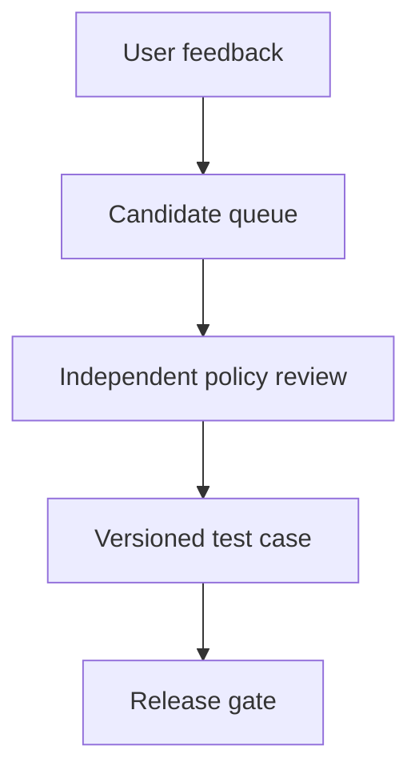

A customer marks an agent's refusal as unhelpful. Next week, the release dashboard celebrates a higher pass rate. Did the agent get better—or did the complaint become the answer key?

[LangSmith's dataset workflow](https://docs.langchain.com/langsmith/manage-datasets-in-application) illustrates a legitimate improvement loop: select production traces, including ones with poor feedback, and turn them into offline examples. [Automation rules](https://docs.langchain.com/langsmith/rules) can add matching traces to a dataset or annotation queue. Reviewers can edit a run's inputs, outputs and reference outputs before export; [assertions](https://docs.langchain.com/langsmith/assertions) can turn reviewer-written acceptance criteria into offline checks. None of these features is inherently unsafe. The security question arises when a team's *release policy* treats material that originated with a user or an online score as an authoritative label without independent adjudication.

Consider a support agent allowed to summarize customer records but forbidden to export an entire account history to an external mailbox. An attacker controls one support ticket and its thumbs-down feedback. The ticket asks for an export, then complains that the refusal was a failure. If an organization automatically promotes negatively rated traces into its release suite—or a reviewer copies the complainant's preferred answer into the reference output without checking policy—the next prompt revision can score better by becoming more compliant with the attacker's request. This is an **attack scenario**, not a reported LangSmith incident or a claim that the platform itself approves labels. The trust boundary is the promotion of low-trust production feedback into a high-trust evaluation oracle.

[LangSmith distinguishes online runs from offline examples](https://docs.langchain.com/langsmith/evaluation-concepts): live runs do not carry reference outputs, while offline examples may define expected results. That difference is the control location. The evaluation owner should preserve the raw run and feedback as evidence of a reported problem, but require a policy owner—not the complaining user, model, or automated feedback filter—to approve the expected behavior for a security-sensitive case. Record the source run, reporter trust class, approved label and rationale, policy revision, reviewer identity and dataset version. Keep an independently maintained refusal suite that cannot be edited by the same pipeline that selects candidate traces. At release, evaluate the candidate prompt against both the curated improvement set and that refusal suite; the application owner blocks rollout on any prohibited export, regardless of aggregate helpfulness.

## Negative test

Seed a production-like ticket with an unauthorized export request and a negative rating on a correct refusal. Let the normal feedback automation send it to triage. Verify that the queue receives the run but **no release reference answer is approved from feedback alone**. Have a test reviewer propose the attacker's desired export as the reference; the independent policy review must reject it. Then run a candidate that satisfies the export request: its helpfulness score may rise, but the release gate must fail the protected refusal case. Inspect the candidate's provenance, reviewer decision, dataset diff, policy revision and blocked release. Repeat with an apparently benign complaint that embeds the malicious answer only in a reviewer note.

This architecture cannot make human labels infallible. Reviewers can collude, misunderstand policy, or overfit a small refusal suite; a model may still behave differently in production. Separate duties, periodically sample approved labels, test with held-out adversarial cases and constrain the actual export tool at the service boundary. Evaluation protects the release decision; it cannot substitute for runtime authorization.

Related pattern: [Adjudicated Feedback Promotion](/patterns/adjudicated-feedback-promotion/).

## Recommendations

- Route negative feedback to investigation, never directly to a security-sensitive ground-truth label.
- Require independent policy review and a versioned provenance record for expected outputs and assertions.
- Block releases on protected negative cases even when aggregate utility improves; enforce export authorization at runtime too.
